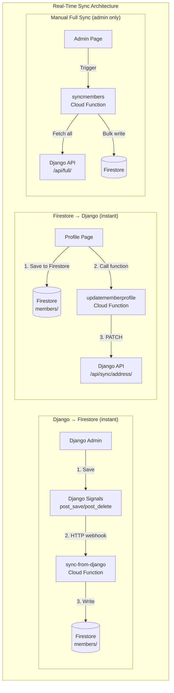
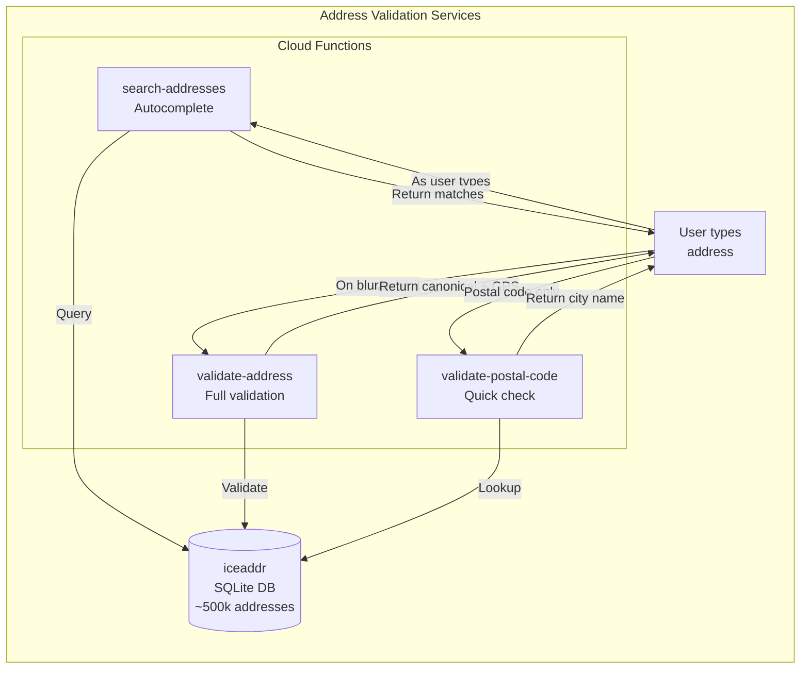
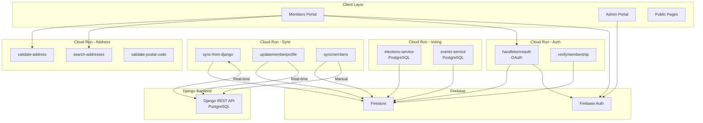
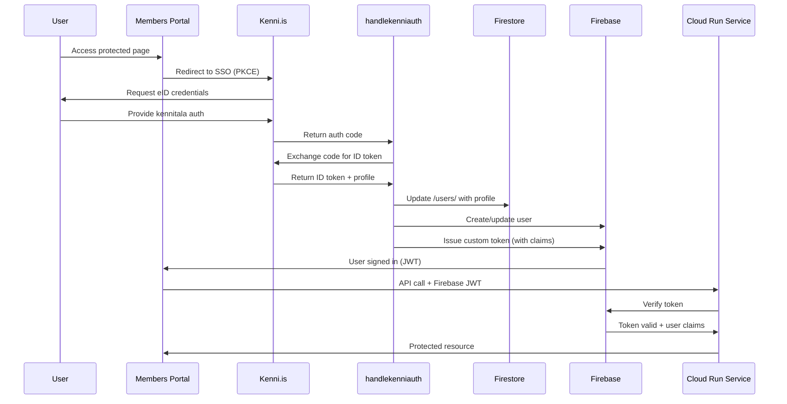

# Cloud Run Services Architecture

**Document Type**: Infrastructure Documentation
**Last Updated**: 2025-12-01
**Status**: ✅ Active - Production Services
**Project**: ekklesia-prod-10-2025
**Region**: europe-west2 (London)

---

## Overview

Ekklesia uses [Google Cloud Run](https://cloud.google.com/run) to deploy and manage microservices. The platform consists of **22 independent services** that work together to provide election management, voting, membership, address validation, and superuser administration functionality.

**Architecture Philosophy**:
- **Microservices** - Small, single-purpose functions that scale independently
- **Real-time sync** - No queues, immediate synchronization between Django and Firestore
- **Django is source of truth** - All membership data originates from Django
- **Firestore is read-optimized cache** - Frontend reads from Firestore for performance

**Security**: All services use [Google Secret Manager](https://cloud.google.com/secret-manager) for sensitive credentials (OAuth secrets, API tokens). Secrets are injected as environment variables at runtime by Cloud Run.

### ⚠️ Secret Manager Environment Variable Naming

**IMPORTANT**: Different deployment methods create different environment variable names:

| Deployment Method | Secret Name | Environment Variable |
|------------------|-------------|---------------------|
| **Firebase CLI** | `django-api-token` | `django-api-token` |
| **gcloud CLI** | `django-api-token` | `DJANGO_API_TOKEN` |

**Recommendation**: Code should check both formats:

```python
token = os.environ.get('django-api-token') or os.environ.get('DJANGO_API_TOKEN')
```

---

## Architecture Diagrams

### Real-Time Bidirectional Sync

The core architectural change in November 2025: **instant bidirectional sync without queues**.



**Key Points:**
- **No queue system** - Changes sync immediately via HTTP webhooks
- **Django signals** trigger `sync-from-django` on every member save/delete
- **Profile page** calls `updatememberprofile` after saving to Firestore
- **syncmembers** is only for manual full sync (admin recovery tool)

### Address Validation Flow (iceaddr)

New in November 2025: Integration with official Icelandic address registry.



**iceaddr Features:**
- Official Icelandic address registry (Þjóðskrá)
- ~500,000 addresses with GPS coordinates
- SQLite database bundled with function (no external API)
- Response time: <100ms

### Service Architecture Overview



### Authentication Flow



---

## Service Inventory

### Core Voting Services

#### 1. elections-service
**Type**: Node.js Container (Express)
**Purpose**: Anonymous ballot recording, voting, and election administration
**Deployment**: Source-based (Dockerfile)
**URL**: https://elections-service-521240388393.europe-west2.run.app
**Authentication**: Public (token-based) + Firebase Auth (admin)

**Key Features**:
- Anonymous ballot submission
- One-time token enforcement
- Vote validation and recording
- Results aggregation
- Admin API (10 endpoints)

**Code Location**: `services/elections/`

---

#### 2. events-service
**Type**: Node.js Container (Express)
**Purpose**: Election management and voting token issuance
**Deployment**: Source-based (Dockerfile)
**URL**: https://events-service-521240388393.europe-west2.run.app
**Authentication**: Public (App Check + JWT)

**Key Features**:
- Election lifecycle management
- Voting token generation
- Token validation and tracking
- Audit logging

**Code Location**: `services/events/`

---

### Authentication & Authorization Services

#### 3. handlekenniauth
**Type**: Cloud Function (Python 3.13)
**Purpose**: Kenni.is OAuth authentication with PKCE
**URL**: https://handlekenniauth-521240388393.europe-west2.run.app
**Authentication**: Public (OAuth callback)

**Key Features**:
- Kenni.is OAuth 2.0 with PKCE
- Government eID (Icelandic National Registry)
- Firebase custom token issuance
- Rate limiting (10 attempts per 10 min per IP)
- **Secret**: `kenni-client-secret`

**Code Location**: `services/members/functions/auth/kenni_flow.py`

---

#### 4. verifymembership
**Type**: Cloud Function (Python 3.13)
**Purpose**: Real-time membership verification from Firestore
**URL**: https://verifymembership-521240388393.europe-west2.run.app
**Authentication**: Require Firebase Auth

**Key Features**:
- Verify user is active member
- Read from Firestore (not Django)
- Return membership details

**Code Location**: `services/members/functions/membership/functions.py`

---

### Data Synchronization Services

#### 5. sync-from-django
**Type**: Cloud Function (Python 3.13)
**Purpose**: Real-time Django → Firestore sync webhook
**URL**: https://sync-from-django-521240388393.europe-west2.run.app
**Authentication**: API key (django-api-token)
**Deployed**: 2025-11-25

**Key Features**:
- Called by Django `post_save`/`post_delete` signals
- Instant sync (no queue, no delay)
- Transforms Django member data to Firestore format
- Updates `profile.addresses` array
- Supports create, update, delete actions
- **Secret**: `django-api-token`

**Code Location**: `services/members/functions/sync_from_django.py`

**Request Format**:
```json
{
  "kennitala": "1234567890",
  "action": "create|update|delete",
  "data": {
    "id": 813,
    "ssn": "1234567890",
    "name": "Member Name",
    "local_address": {
      "street": "Streetname",
      "number": 1,
      "postal_code": 101,
      "city": "Reykjavík"
    },
    "contact_info": { "email": "...", "phone": "..." },
    "unions": [{"name": "Union"}],
    "titles": [{"name": "Title"}]
  }
}
```

---

#### 6. updatememberprofile
**Type**: Cloud Function (Python 3.13)
**Purpose**: Real-time Firestore → Django sync for profile AND address updates
**URL**: https://updatememberprofile-521240388393.europe-west2.run.app
**Authentication**: Require Firebase Auth (own profile only)
**Updated**: 2025-11-25

**Key Features**:
- Real-time profile updates (name, email, phone)
- **Real-time address sync** to Django
- Calls Django `/api/sync/address/` endpoint
- Links addresses to Icelandic registry (map_address)
- Logs to `syncHistory` subcollection
- **Secret**: `django-api-token`

**Code Location**: `services/members/functions/membership/functions.py`

**Address Sync Flow**:
1. User saves address in profile page
2. Frontend saves to Firestore
3. Frontend calls updatememberprofile
4. Function extracts default address
5. Calls Django `/api/sync/address/`
6. Django creates/updates NewLocalAddress
7. Django links to map_address registry
8. Returns success with linked address ID

---

#### 7. syncmembers
**Type**: Cloud Function (Python 3.13)
**Purpose**: Manual full sync (admin-triggered disaster recovery)
**URL**: https://syncmembers-521240388393.europe-west2.run.app
**Authentication**: Firebase Auth (admin/superuser only)

**Key Features**:
- Manual-only (no schedule)
- Full member data sync from Django
- Used for initial setup or recovery
- **Secret**: `django-api-token`

**Code Location**: `services/members/functions/sync_members.py`

**When to Use**:
- Initial database population
- After major Django data migration
- Disaster recovery

---

### Address Validation Services (iceaddr)

#### 8. search-addresses
**Type**: Cloud Function (Python 3.13)
**Purpose**: Icelandic address autocomplete
**URL**: https://search-addresses-521240388393.europe-west2.run.app
**Authentication**: Allow unauthenticated
**Deployed**: 2025-11-25

**Key Features**:
- Fast autocomplete (<100ms)
- Searches street names, numbers
- Returns GPS coordinates
- Uses iceaddr SQLite database

**Code Location**: `services/members/functions/search_addresses.py`

**Request**: `GET ?q=Laugaveg&limit=10`

**Response**:
```json
{
  "results": [
    {
      "street": "Laugavegur",
      "number": 1,
      "postal_code": "101",
      "city": "Reykjavík",
      "latitude": 64.1466,
      "longitude": -21.9426
    }
  ]
}
```

---

#### 9. validate-address
**Type**: Cloud Function (Python 3.13)
**Purpose**: Full Icelandic address validation
**URL**: https://validate-address-521240388393.europe-west2.run.app
**Authentication**: Allow unauthenticated
**Deployed**: 2025-11-25

**Key Features**:
- Validates street + house number
- Returns canonical format
- Returns GPS coordinates
- Returns validation errors

**Code Location**: `services/members/functions/validate_address.py`

---

#### 10. validate-postal-code
**Type**: Cloud Function (Python 3.13)
**Purpose**: Quick postal code validation
**URL**: https://validate-postal-code-521240388393.europe-west2.run.app
**Authentication**: Allow unauthenticated
**Deployed**: 2025-11-25

**Key Features**:
- Validates Icelandic postal codes (100-999)
- Returns city/town name
- Fast (<50ms)

**Code Location**: `services/members/functions/validate_address.py`

---

### Audit & Monitoring Services

#### 11. auditmemberchanges
**Type**: Cloud Function (Python 3.13)
**Purpose**: Audit logging for member data changes
**URL**: https://auditmemberchanges-521240388393.europe-west2.run.app
**Authentication**: Require authentication (internal)

**Key Features**:
- Log all member profile changes
- Track who made changes
- Retention: 90 days

**Code Location**: `services/members/functions/audit_members.py`

---

#### 12. cleanupauditlogs
**Type**: Cloud Function (Python 3.13)
**Purpose**: Cleanup old audit logs
**Authentication**: Callable (internal)

**Key Features**:
- Keeps only most recent N logs
- Prevents unlimited storage growth

**Code Location**: `services/members/functions/membership/functions.py`

---

#### 13. healthz
**Type**: Cloud Function (Python 3.13)
**Purpose**: Health check and configuration sanity
**URL**: https://healthz-521240388393.europe-west2.run.app
**Authentication**: Public (GET only)

**Key Features**:
- Configuration sanity checks
- JWKS cache statistics
- Correlation ID tracking

**Code Location**: `services/members/functions/auth/kenni_flow.py`

---

### Admin Utilities

#### 14. get-django-token
**Type**: Cloud Function (Python 3.13)
**Purpose**: Provide Django API token to authorized admins
**URL**: https://get-django-token-521240388393.europe-west2.run.app
**Authentication**: Require Firebase Auth (admin/superuser)

**Key Features**:
- Securely provide Django API token
- Role-based access control
- Audit logging
- **Secret**: `django-api-token`

**Code Location**: `services/members/functions/get_django_token.py`

---

### Superuser Console Services

These services power the Superuser Console for system administration, monitoring, and GDPR compliance operations.

#### 15. checksystemhealth
**Type**: Cloud Function (Python 3.13)
**Purpose**: System health monitoring API for superuser dashboard
**URL**: https://checksystemhealth-521240388393.europe-west2.run.app
**Authentication**: Require Firebase Auth (superuser only)
**Deployed**: 2025-12-01

**Key Features**:
- Checks health of all Cloud Run services
- Monitors Cloud SQL (PostgreSQL) status
- Monitors Firestore connectivity
- Checks external services (Django/Linode)
- Returns comprehensive health summary

**Code Location**: `services/members/functions/superuser_functions.py`

---

#### 16. setuserrole
**Type**: Cloud Function (Python 3.13)
**Purpose**: Set Firebase custom claims (role management)
**URL**: https://setuserrole-521240388393.europe-west2.run.app
**Authentication**: Require Firebase Auth (superuser only)
**Deployed**: 2025-12-01

**Key Features**:
- Set user roles: member, admin, superuser
- Updates Firebase Auth custom claims
- Updates Firestore /users/ document
- Prevents self-demotion
- Audit logging

**Code Location**: `services/members/functions/superuser_functions.py`

---

#### 17. getuserrole
**Type**: Cloud Function (Python 3.13)
**Purpose**: Get Firebase custom claims for a user
**URL**: https://getuserrole-521240388393.europe-west2.run.app
**Authentication**: Require Firebase Auth (superuser only)
**Deployed**: 2025-12-01

**Key Features**:
- Retrieve user role and claims
- Return user metadata (email, displayName, disabled status)
- Return last sign-in timestamp

**Code Location**: `services/members/functions/superuser_functions.py`

---

#### 18. getauditlogs
**Type**: Cloud Function (Python 3.13)
**Purpose**: Query Cloud Logging for audit events
**URL**: https://getauditlogs-521240388393.europe-west2.run.app
**Authentication**: Require Firebase Auth (superuser only)
**Deployed**: 2025-12-01

**Key Features**:
- Query audit events from Cloud Logging
- Filter by service, severity, time range
- Filter by correlation ID for request tracing
- Returns structured log entries

**Code Location**: `services/members/functions/superuser_functions.py`

---

#### 19. getloginaudit
**Type**: Cloud Function (Python 3.13)
**Purpose**: Get login history from Firestore
**URL**: https://getloginaudit-521240388393.europe-west2.run.app
**Authentication**: Require Firebase Auth (superuser only)
**Deployed**: 2025-12-01

**Key Features**:
- Query login history from /users/ collection
- Filter by success/failed status
- Filter by user name or email
- Returns user agent, auth method, timestamps
- Calculates success/failure statistics

**Code Location**: `services/members/functions/superuser_functions.py`

---

#### 20. harddeletemember
**Type**: Cloud Function (Python 3.13)
**Purpose**: Permanently delete member (GDPR compliance)
**URL**: https://harddeletemember-521240388393.europe-west2.run.app
**Authentication**: Require Firebase Auth (superuser only)
**Deployed**: 2025-12-01

**Key Features**:
- **DANGEROUS OPERATION** - Requires confirmation phrase "EYÐA VARANLEGA"
- Deletes from Firebase Auth
- Deletes from Firestore /users/ collection
- Deletes from Firestore /members/ collection
- Full audit logging

**Code Location**: `services/members/functions/superuser_functions.py`

---

#### 21. anonymizemember
**Type**: Cloud Function (Python 3.13)
**Purpose**: Anonymize member data (GDPR compliance)
**URL**: https://anonymizemember-521240388393.europe-west2.run.app
**Authentication**: Require Firebase Auth (superuser only)
**Deployed**: 2025-12-01

**Key Features**:
- **DANGEROUS OPERATION** - Requires confirmation phrase "NAFNLAUSA"
- Replaces PII with anonymous ID (ANON-XXXXXXXX)
- Preserves statistical data (region, memberSince)
- Disables Firebase Auth account
- Full audit logging

**Code Location**: `services/members/functions/superuser_functions.py`

---

### Demo/Experimental Services

Services under development or evaluation, not yet in production use.

#### 22. django-socialism-demo
**Type**: Container (Docker)
**Purpose**: Experimental Django backend on GCP Cloud Run
**URL**: https://django-socialism-demo-521240388393.europe-west2.run.app
**Authentication**: Allow unauthenticated
**Status**: Demo/Evaluation

**Key Features**:
- Potential replacement for Linode-hosted Django
- Cloud Run deployment of Django backend
- Under evaluation for production migration

**Code Location**: External container deployment

---

## Service Dependencies

### External Dependencies

**PostgreSQL (Cloud SQL)**:
- elections-service
- events-service

**Firebase Services**:
- Authentication (all services)
- Firestore (membership cache, audit logs)
- App Check (elections, events)

**External APIs**:
- **Kenni.is OAuth**: handlekenniauth
- **Django API**: sync-from-django, updatememberprofile, syncmembers

### Services That Do NOT Call Django

These services read from Firestore only:
- ✅ verifymembership
- ✅ elections-service
- ✅ events-service
- ✅ handlekenniauth (calls Kenni.is OAuth)
- ✅ auditmemberchanges
- ✅ search-addresses (iceaddr local DB)
- ✅ validate-address (iceaddr local DB)
- ✅ validate-postal-code (iceaddr local DB)

---

## Scaling Configuration

### Core Services

| Service | Min | Max | Memory | Timeout |
|---------|-----|-----|--------|---------|
| elections-service | 0 | 100 | 512Mi | 60s |
| events-service | 0 | 100 | 512Mi | 60s |
| handlekenniauth | 0 | 10 | 256Mi | 30s |
| verifymembership | 0 | 10 | 256Mi | 30s |

### Data Sync Services

| Service | Min | Max | Memory | Timeout |
|---------|-----|-----|--------|---------|
| sync-from-django | 0 | 10 | 256Mi | 30s |
| updatememberprofile | 0 | 5 | 256Mi | 30s |
| syncmembers | 0 | 1 | 512Mi | 540s |

### Address Services

| Service | Min | Max | Memory | Timeout |
|---------|-----|-----|--------|---------|
| search-addresses | 0 | 10 | 256Mi | 30s |
| validate-address | 0 | 10 | 256Mi | 30s |
| validate-postal-code | 0 | 10 | 256Mi | 30s |

### Audit & Monitoring Services

| Service | Min | Max | Memory | Timeout |
|---------|-----|-----|--------|---------|
| auditmemberchanges | 0 | 5 | 256Mi | 60s |
| cleanupauditlogs | 0 | 1 | 256Mi | 60s |
| healthz | 0 | 1 | 256Mi | 30s |
| get-django-token | 0 | 1 | 256Mi | 30s |

### Superuser Console Services

| Service | Min | Max | Memory | Timeout |
|---------|-----|-----|--------|---------|
| checksystemhealth | 0 | 5 | 256Mi | 30s |
| setuserrole | 0 | 5 | 256Mi | 30s |
| getuserrole | 0 | 5 | 256Mi | 30s |
| getauditlogs | 0 | 5 | 256Mi | 60s |
| getloginaudit | 0 | 5 | 256Mi | 30s |
| harddeletemember | 0 | 1 | 256Mi | 60s |
| anonymizemember | 0 | 1 | 256Mi | 60s |

### Demo Services

| Service | Min | Max | Memory | Timeout |
|---------|-----|-----|--------|---------|
| django-socialism-demo | 0 | 10 | 512Mi | 60s |

---

## Deployment Procedures

### Firebase Functions

```bash
cd services/members/functions

# Deploy all functions
firebase deploy --only functions

# Deploy specific function
firebase deploy --only functions:sync_from_django
firebase deploy --only functions:updatememberprofile
```

### Cloud Run Services (elections, events)

```bash
cd services/elections
gcloud run deploy elections-service \
  --source=. \
  --region=europe-west2 \
  --project=ekklesia-prod-10-2025
```

---

## Troubleshooting

### "Django sync failed"

**Check Django signals are working:**
```bash
# Check Django logs
~/django-ssh.sh "sudo journalctl -u gunicorn -n 50"

# Check sync-from-django logs
gcloud functions logs read sync_from_django --region=europe-west2 --limit=20
```

### "Address validation not working"

**Check iceaddr functions:**
```bash
# Test search
curl "https://europe-west2-ekklesia-prod-10-2025.cloudfunctions.net/search_addresses?q=Laugaveg"

# Check logs
gcloud functions logs read search_addresses --region=europe-west2 --limit=10
```

---

## Changelog

| Date | Change |
|------|--------|
| 2025-12-01 | **MAJOR**: Added Superuser Console Services (7 new functions) |
| 2025-12-01 | Added checksystemhealth, setuserrole, getuserrole |
| 2025-12-01 | Added getauditlogs, getloginaudit |
| 2025-12-01 | Added harddeletemember, anonymizemember (GDPR compliance) |
| 2025-12-01 | Added django-socialism-demo (experimental GCP Django) |
| 2025-12-01 | Fixed all service URLs (old ymzrguoifa format → 521240388393) |
| 2025-12-01 | Updated total service count: 14 → 22 |
| 2025-11-25 | **MAJOR**: Real-time sync architecture (no queues) |
| 2025-11-25 | Added sync-from-django (Django→Firestore webhook) |
| 2025-11-25 | Added iceaddr services (search, validate, postal) |
| 2025-11-25 | Updated updatememberprofile with address sync |
| 2025-11-25 | **DELETED** bidirectional-sync (replaced by real-time) |
| 2025-11-25 | **DELETED** track_member_changes (no queue needed) |
| 2025-11-22 | Added track_member_changes Firestore trigger |
| 2025-11-22 | Fixed bidirectional-sync queue processing |
| 2025-11-10 | Secret Manager integration |
| 2025-10-31 | Initial documentation |

---

**Document Status**: ✅ Complete and Verified
**Last Review**: 2025-12-01
**Next Review**: 2026-03-01
