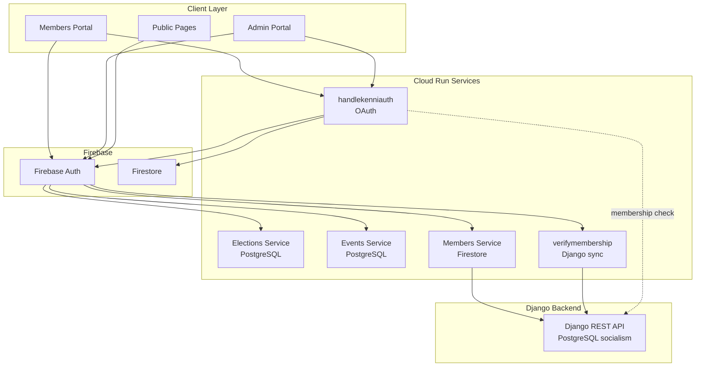
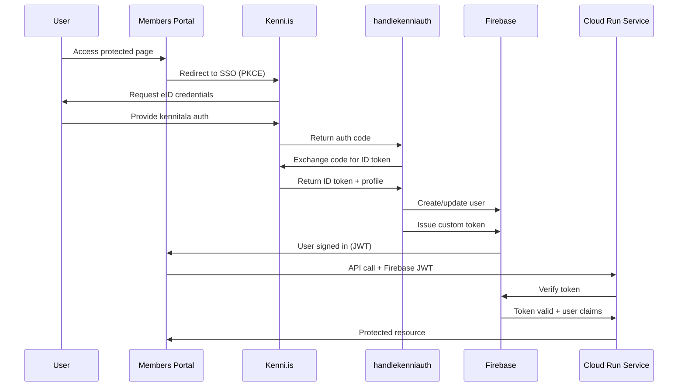
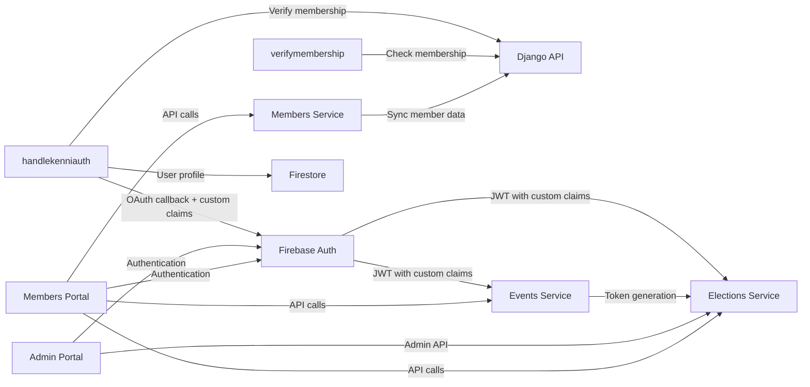

# Cloud Run Services Architecture

**Document Type**: Infrastructure Documentation
**Last Updated**: 2025-11-22
**Status**: ✅ Active - Deployed Services (Beta)
**Project**: ekklesia-prod-10-2025
**Region**: europe-west2 (London)

---

## Overview

Ekklesia uses [Google Cloud Run](https://cloud.google.com/run) to deploy and manage microservices. The platform consists of **13 independent services** that work together to provide election management, voting, and membership functionality.

**Architecture Philosophy**: [Microservices](https://microservices.io/) approach with small, single-purpose functions that scale independently.

**Security**: All services use [Google Secret Manager](https://cloud.google.com/secret-manager) for sensitive credentials (OAuth secrets, API tokens). Secrets are injected as environment variables at runtime by Cloud Run.

---

## Architecture Diagrams

Visual representations of the Ekklesia Cloud Run architecture, showing how services interact and how authentication flows through the system.

### Service Architecture Overview

The diagram below shows the high-level architecture of Ekklesia's microservices, organized into layers:



**Key Components:**
- **Client Layer**: Member portal, admin portal, and public-facing pages
- **Firebase**: Centralized authentication and Firestore database (custom claims include membership data)
- **Cloud Run Services**: 13 microservices handling elections, membership, and authentication
- **Django Backend**: Legacy PostgreSQL database (socialism DB) with REST API - source of truth for membership
- **Note**: Elections Service does NOT call Django directly; it uses Firebase custom claims set by handlekenniauth

### Authentication Flow

This sequence diagram shows how users authenticate through Kenni.is (Icelandic eID) and access protected Cloud Run services:



**Security Features:**
- **PKCE**: Proof Key for Code Exchange prevents authorization code interception
- **Kenni.is**: Government-backed eID authentication using Icelandic National Registry
- **Firebase JWT**: Short-lived tokens with custom claims for role-based access control
- **Token Verification**: All Cloud Run services verify tokens with Firebase before serving requests

### Service Dependencies

This diagram shows the dependencies between Cloud Run services:



**Dependency Notes:**
- **Django Backend**: Source of truth for membership data, synced to Firestore via Members Service
- **Firebase Auth**: Central authentication for all services (JWT verification with custom claims)
- **Elections Service**: Independent PostgreSQL database for anonymous voting; NO direct Django connection
- **Events Service**: Token generation for elections (coordinates with Elections Service)
- **Membership verification flow**: Django → handlekenniauth → Firebase custom claims → Elections Service
- **Key insight**: Elections/Events Services use Firebase JWT custom claims for eligibility, not direct Django API calls

---

## Service Inventory

### Core Voting Services

#### 1. elections-service
**Type**: Node.js Container (Express)
**Purpose**: Anonymous ballot recording, voting, and election administration
**Deployment**: Source-based (Dockerfile)
**URL**: https://elections-service-521240388393.europe-west2.run.app
**Authentication**:
- Public access (token-based voting)
- Firebase Auth (admin API)
**Latest Deploy**: 2025-10-31 (revision 00010-lzw)

**Key Features**:
- Anonymous ballot submission
- One-time token enforcement
- Vote validation and recording
- Results aggregation (server-to-server only)
- **Admin API** (10 endpoints):
  - Full CRUD for elections management
  - Lifecycle management (draft → published → closed)
  - Soft delete (hide/unhide)
  - Hard delete (superadmin only)
  - Results retrieval for closed elections

**Technology Stack**:
- [Node.js 18+](https://nodejs.org/)
- [Express 4.21.2](https://expressjs.com/)
- [PostgreSQL](https://www.postgresql.org/) (via [`pg` 8.11.3](https://node-postgres.com/))
- [Firebase Admin 13.5.0](https://firebase.google.com/docs/admin/setup)

**Code Location**: `services/elections/`

**Dependencies**:
```json
{
  "express": "^4.21.2",
  "pg": "^8.11.3",
  "firebase-admin": "^13.5.0",
  "cors": "^2.8.5",
  "dotenv": "^16.6.1"
}
```

**Security Status**: ✅ 0 vulnerabilities (npm audit)

**Admin API Endpoints** (Added Nov 2025 - Issue #192):

*CRUD Operations:*
1. `GET /api/admin/elections` - List elections (filters: status, hidden, search, pagination)
2. `POST /api/admin/elections` - Create election (draft status)
3. `GET /api/admin/elections/:id` - Get single election
4. `PATCH /api/admin/elections/:id` - Update election (draft only)

*Lifecycle Management:*
5. `POST /api/admin/elections/:id/open` - Publish election
6. `POST /api/admin/elections/:id/close` - Close voting

*Soft Delete:*
7. `POST /api/admin/elections/:id/hide` - Hide election
8. `POST /api/admin/elections/:id/unhide` - Restore hidden election

*Hard Delete & Results:*
9. `DELETE /api/admin/elections/:id` - Permanent delete (superadmin only)
10. `GET /api/admin/elections/:id/results` - Get results (closed elections)

**RBAC Implementation**:
- Middleware: `services/elections/src/middleware/rbacAuth.js`
- Roles: `election-manager` (full CRUD), `superadmin` (+ hard delete)
- Authentication: Firebase token verification with custom claims
- All admin endpoints require valid Firebase ID token

**Database Schema**:
- Migration 003 (`003_admin_features.sql`) adds:
  - `hidden` (BOOLEAN) - Soft delete flag
  - `voting_type` (VARCHAR) - 'single-choice' or 'multi-choice'
  - `max_selections` (INTEGER) - Max selections for multi-choice
  - `eligibility` (VARCHAR) - Who can vote: 'members', 'admins', 'all'
  - `scheduled_start`/`scheduled_end` (TIMESTAMP) - Optional scheduling
  - `updated_by` (VARCHAR) - Last modifier UID

---

#### 2. events-service
**Type**: Node.js Container (Express)
**Purpose**: Election management and voting token issuance
**Deployment**: Source-based (Dockerfile)
**URL**: https://events-service-521240388393.europe-west2.run.app
**Authentication**: Public access (App Check + JWT validation)
**Latest Deploy**: 2025-10-31 (revision 00021-w6g)

**Key Features**:
- Election lifecycle management
- Voting token generation and issuance
- Token validation and tracking
- Audit logging for token operations

**Technology Stack**:
- [Node.js 18+](https://nodejs.org/)
- [Express 4.21.2](https://expressjs.com/)
- [PostgreSQL](https://www.postgresql.org/) (via [`pg` 8.11.3](https://node-postgres.com/))
- [Firebase Admin 13.5.0](https://firebase.google.com/docs/admin/setup)

**Code Location**: `services/events/`

**Dependencies**:
```json
{
  "express": "^4.21.2",
  "pg": "^8.11.3",
  "firebase-admin": "^13.5.0",
  "cors": "^2.8.5",
  "dotenv": "^16.6.1"
}
```

**Security Status**: ✅ 0 vulnerabilities (npm audit)

---

### Authentication & Authorization Services

#### 3. handlekenniauth
**Type**: Cloud Function (Python 3.13)
**Purpose**: Kenni.is OAuth authentication integration with PKCE
**Deployment**: Firebase Cloud Functions Gen2
**URL**: https://handlekenniauth-ymzrguoifa-nw.a.run.app
**Authentication**: Public access (OAuth callback endpoint)
**Latest Deploy**: 2025-11-10

**Key Features**:
- Kenni.is OAuth 2.0 flow with PKCE
- Government eID authentication (Icelandic National Registry)
- User profile creation/update from Þjóðskrá
- Firebase custom token issuance
- Rate limiting (10 attempts per 10 min per IP)
- Input validation (DoS protection)
- Structured logging with correlation IDs

**Technology Stack**:
- Python 3.13 (Firebase Functions Gen2)
- Firebase Admin SDK (Python)
- Firebase Authentication
- Kenni.is OAuth 2.0 API
- JWT token verification with JWKS caching
- **Secret Manager**: `KENNI_IS_CLIENT_SECRET` (OAuth client secret)

**Code Location**: `services/members/functions/auth/kenni_flow.py`

**Usage**: **Most frequently used service** (136 references in codebase)

**OAuth Flow (PKCE)**:
1. Frontend generates PKCE code verifier + challenge
2. Frontend initiates OAuth with Kenni.is (includes challenge)
3. User authenticates with Icelandic eID (kennitala)
4. Kenni.is redirects back with authorization code
5. Frontend sends code + verifier to this service
6. Service exchanges code for ID token (validates verifier)
7. Service verifies ID token signature (JWKS)
8. Service creates/updates Firebase user
9. Service issues Firebase custom token
10. Frontend signs in with custom token

---

#### 4. verifymembership
**Type**: Cloud Function (Node.js)
**Purpose**: Real-time membership verification
**Deployment**: Firebase Cloud Functions
**URL**: https://verifymembership-521240388393.europe-west2.run.app
**Authentication**: Require authentication (Firebase Auth)
**Latest Deploy**: 2025-10-29

**Key Features**:
- Verify user is active member
- Check membership status in Django backend
- Cache verification results
- Return membership details (name, email, phone, roles)

**Technology Stack**:
- Node.js (Firebase Functions)
- Firebase Admin SDK
- Django API integration
- Firestore (membership cache)

**Code Location**: `services/members/functions/verifymembership/`

**Usage**: 48 references in codebase (critical security function)

**Verification Flow**:
1. Frontend requests verification (with Firebase token)
2. Service validates Firebase token
3. Service checks Firestore cache (60 min TTL)
4. If cache miss: fetch from Django API
5. Update Firestore with fresh data
6. Return membership details to frontend

---

### Data Synchronization Services

#### 5. syncmembers
**Type**: Cloud Function (Python 3.13) - HTTP Trigger
**Purpose**: Manual membership synchronization (admin-triggered)
**Deployment**: Firebase Cloud Functions Gen2
**URL**: https://syncmembers-ymzrguoifa-nw.a.run.app
**Authentication**: Allow unauthenticated (CORS preflight) + Manual Bearer Token Verification
**Latest Deploy**: 2025-11-22

**Key Features**:
- Manual sync from Django backend (triggered by admin)
- Full member data sync (profile, contact, addresses, roles)
- Firestore members collection update
- Sync statistics and audit logging
- Normalizes kennitala, phone, and email formats
- **Manual CORS handling** for browser fetch support

**Technology Stack**:
- Python 3.13 (Firebase Functions Gen2)
- Firebase Admin SDK (Python)
- Django API integration (`/felagar/api/full/`)
- **Secret Manager**: `DJANGO_API_TOKEN` (Django API authentication)

**Code Location**: `services/members/functions/sync_members.py`

**Usage**: 19 references in codebase

**Sync Process**:
1. Admin triggers sync from dashboard (browser fetch)
2. Service handles CORS preflight (OPTIONS)
3. Service manually verifies Firebase ID token (Bearer)
4. Service validates admin/superuser role
5. Fetch all members from Django API (paginated)
6. Transform Django member format → Firestore format
7. Normalize kennitala (remove hyphen), phone (7 digits), email (lowercase)
8. Upsert members to Firestore (keyed by kennitala)
9. Create sync log with statistics (added, updated, errors)
10. Return sync results to admin

---

#### 6. updatememberprofile
**Type**: Cloud Function (Python 3.13)
**Purpose**: Update member profile information
**Deployment**: Firebase Cloud Functions Gen2
**URL**: https://updatememberprofile-ymzrguoifa-nw.a.run.app
**Authentication**: Require authentication (Firebase Auth - members can only update their own profile)
**Latest Deploy**: 2025-11-10

**Key Features**:
- Update member profile (name, email, phone)
- Push changes to Django backend (ComradeFullViewSet PATCH)
- Update Firestore cache with canonical Django data
- Self-service profile updates (users update their own data)
- Phone normalization (7 local digits, removes country code)

**Technology Stack**:
- Python 3.13 (Firebase Functions Gen2)
- Firebase Admin SDK (Python)
- Django API integration (`/felagar/api/members/:id/`)
- **Secret Manager**: `DJANGO_API_TOKEN` (Django API authentication)

**Code Location**: `services/members/functions/membership/functions.py` (updatememberprofile_handler)

**Usage**: 3 references in codebase

**Update Flow**:
1. Frontend sends profile update request with kennitala + updates
2. Service validates Firebase token
3. Service verifies user is updating their own profile (kennitala match)
4. Lookup Django member ID from Firestore (faster than Django search)
5. Build Django PATCH payload (name, contact_info.email, contact_info.phone)
6. Push update to Django API
7. Update Firestore with normalized data
8. Return success with updated member data

---

#### 7. bidirectional-sync
**Type**: Cloud Function (Python 3.13)
**Purpose**: Bi-directional sync Django ↔ Firestore
**Deployment**: gcloud functions (Gen2)
**URL**: https://bidirectional-sync-ymzrguoifa-nw.a.run.app
**Authentication**: Allow unauthenticated (triggered by Cloud Scheduler)
**Latest Deploy**: 2025-11-22

**Key Features**:
- Scheduled sync (Cloud Scheduler: daily at 3:30 AM UTC)
- Bi-directional sync: Firestore → Django AND Django → Firestore
- Detects changes since last sync (timestamp-based)
- Syncs only modified members (optimized for performance)
- Tracks sync queue for pending Firestore→Django updates

**Technology Stack**:
- Python 3.13 (Cloud Functions Gen2)
- Firebase Admin SDK (Python)
- Django API integration
- **Secret Manager**: `DJANGO_API_TOKEN` (Django API authentication)

**Code Location**: `services/members/functions/bidirectional_sync.py`

**Sync Process**:
1. Get last sync timestamp from Firestore metadata
2. **Firestore → Django**: Check sync_queue for pending updates
3. Push pending updates to Django API
4. Mark queue items as synced
5. **Django → Firestore**: Fetch modified members since last sync
6. Update Firestore with Django changes
7. Update last sync timestamp

---


#### 8. get-django-token
**Type**: Cloud Function (Python 3.13)
**Purpose**: Provide Django API token to authorized admins
**Deployment**: gcloud functions (Gen2)
**URL**: https://get-django-token-ymzrguoifa-nw.a.run.app
**Authentication**: Require authentication (admin/superuser role required)
**Latest Deploy**: 2025-11-10

**Key Features**:
- Securely provide Django API token to admin users
- Role-based access control (admin or superuser only)
- Firebase token verification
- Audit logging of token access

**Technology Stack**:
- Python 3.13 (Cloud Functions Gen2)
- Firebase Admin SDK (Python)
- **Secret Manager**: `DJANGO_API_TOKEN` (Django API token)

**Code Location**: `services/members/functions/get_django_token.py`

**Access Flow**:
1. Admin sends request with Firebase ID token
2. Service verifies Firebase token
3. Service checks user roles (must have admin or superuser)
4. If authorized: return Django API token
5. Log token access (user UID, email, timestamp)

---

### Audit & Monitoring Services

#### 9. auditmemberchanges
**Type**: Cloud Function (Python)
**Purpose**: Audit logging for member data changes
**Deployment**: Firebase Cloud Functions
**URL**: https://auditmemberchanges-521240388393.europe-west2.run.app
**Authentication**: Require authentication (internal only)
**Latest Deploy**: 2025-10-29

**Key Features**:
- Log all member profile changes
- Track who made changes (admin vs self-service)
- Store change history in Firestore
- Retention: 90 days

**Technology Stack**:
- Python 3.11
- Firebase Admin SDK (Python)
- Firestore (audit logs)

**Code Location**: `services/members/functions/auditmemberchanges/`

**Usage**: 4 references in codebase

**Logged Events**:
- Profile updates (email, phone, address)
- Role changes (admin, member)
- Membership status changes
- Authentication events

**Audit Log Schema**:
```json
{
  "timestamp": "2025-10-31T12:00:00Z",
  "user_id": "firebase_uid",
  "action": "profile_update",
  "changes": {
    "email": {"old": "old@example.com", "new": "new@example.com"}
  },
  "actor": "user_self | admin_uid",
  "ip_address": "1.2.3.4"
}
```

---

#### 10. track_member_changes
**Type**: Cloud Function (Python 3.11)
**Purpose**: Track Firestore member changes for sync
**Deployment**: gcloud functions (Gen2)
**Trigger**: Firestore document write (`members/{memberId}`)
**Authentication**: Internal (Eventarc Trigger)
**Latest Deploy**: 2025-11-22

**Key Features**:
- Real-time change tracking
- Adds changes to `sync_queue` collection
- Filters out redundant updates
- Supports bi-directional sync architecture

**Technology Stack**:
- Python 3.11 (Cloud Functions Gen2)
- Firebase Admin SDK (Python)
- Firestore Triggers (Eventarc)

**Code Location**: `services/members/functions/track_member_changes.py`

**Usage**: Critical for Firestore -> Django sync

**Sync Process**:
1. Firestore document written (create/update/delete)
2. Function triggered by Eventarc
3. Extract changed fields
4. Add entry to `sync_queue` with status 'pending'
5. `bidirectional-sync` later processes this queue

---

#### 11. healthz
**Type**: Cloud Function (Python 3.13)
**Purpose**: Health check and configuration sanity endpoint
**Deployment**: Firebase Cloud Functions Gen2
**URL**: https://healthz-ymzrguoifa-nw.a.run.app
**Authentication**: Public access (GET only)
**Latest Deploy**: 2025-11-10

**Key Features**:
- Configuration sanity checks (environment variables present)
- JWKS cache statistics (Kenni.is token verification)
- CORS support for monitoring tools
- Correlation ID tracking

**Technology Stack**:
- Python 3.13 (Firebase Functions Gen2)
- Firebase Admin SDK (Python)

**Code Location**: `services/members/functions/auth/kenni_flow.py` (healthz_handler)

**Usage**: 7 references in codebase

**Health Check Response**:
```json
{
  "ok": true,
  "env": {
    "KENNI_IS_ISSUER_URL": true,
    "KENNI_IS_CLIENT_ID": true,
    "KENNI_IS_CLIENT_SECRET": true,
    "KENNI_IS_REDIRECT_URI": true
  },
  "jwks": {
    "hits": 42,
    "misses": 3,
    "size": 1
  },
  "issuerConfigured": true,
  "correlationId": "uuid-here"
}
```

**Note**: Returns boolean values for environment variables (presence check only, not actual values)

---

#### 12. cleanupauditlogs
**Type**: Cloud Function (Python 3.13)
**Purpose**: Cleanup old audit logs (retention policy enforcement)
**Deployment**: Firebase Cloud Functions Gen2
**Authentication**: Require authentication (Callable)
**Latest Deploy**: 2025-11-10

**Key Features**:
- Keeps only most recent N logs (default 50)
- Prevents unlimited storage growth
- Manual trigger or scheduled

**Technology Stack**:
- Python 3.13 (Firebase Functions Gen2)
- Firebase Admin SDK (Python)

**Code Location**: `services/members/functions/cleanup_audit_logs.py`

**Usage**: Maintenance task

---

## Deployment History

### Recent Deployments (Last 7 Days)

| Service | Date | Deployer | Changes |
|---------|------|----------|---------|
| syncmembers | 2025-11-22 | gudrodur@sosialistaflokkurinn.is | Refactor to HTTP trigger, manual CORS/Auth |
| bidirectional-sync | 2025-11-22 | gudrodur@sosialistaflokkurinn.is | Redeploy for sync queue fixes |
| track_member_changes | 2025-11-22 | gudrodur@sosialistaflokkurinn.is | Initial deployment (Firestore trigger) |
| handlekenniauth | 2025-11-10 | gudrodur@sosialistaflokkurinn.is | Secret Manager integration (KENNI_IS_CLIENT_SECRET) |
| healthz | 2025-11-10 | gudrodur@sosialistaflokkurinn.is | Updated to Python 3.13, config sanity checks |
| syncmembers | 2025-11-10 | gudrodur@sosialistaflokkurinn.is | Secret Manager integration (DJANGO_API_TOKEN) |
| updatememberprofile | 2025-11-10 | gudrodur@sosialistaflokkurinn.is | Secret Manager integration, env var usage |
| bidirectional-sync | 2025-11-10 | gudrodur@sosialistaflokkurinn.is | Secret Manager integration, remove direct API calls |

| get-django-token | 2025-11-10 | gudrodur@sosialistaflokkurinn.is | Secret Manager integration, admin token access |
| elections-service | 2025-10-31 | gudrodur@sosialistaflokkurinn.is | Dependencies update (express 4.21.2, dotenv 16.6.1) |
| events-service | 2025-10-31 | gudrodur@sosialistaflokkurinn.is | Dependencies update (express 4.21.2, firebase-admin 13.5.0) |

---

## Service Dependencies

### Dependency Graph

```
┌─────────────────────────────────────────────────────────────────┐
│                         Frontend (Firebase Hosting)              │
│                     apps/members-portal/                         │
└────────────────────────┬────────────────────────────────────────┘
                         │
         ┌───────────────┼───────────────┐
         ▼               ▼               ▼
   ┌──────────┐   ┌──────────┐   ┌──────────┐
   │handlekenn│   │verifymemb│   │elections-│
   │  iauth   │   │ ership   │   │ service  │
   └────┬─────┘   └────┬─────┘   └────┬─────┘
        │              │              │
        └──────────────┼──────────────┘
                       ▼
              ┌─────────────────┐
              │  events-service │
              └────────┬────────┘
                       │
         ┌─────────────┼─────────────┐
         ▼             ▼             ▼
   ┌──────────┐  ┌──────────┐  ┌──────────┐
   │syncmembers│  │updatemem│  │auditmemb│
   └──────────┘  │berprofile│  │erchanges│
                 └──────────┘  └──────────┘
```

### External Dependencies

**PostgreSQL Database (Cloud SQL)**:
- elections-service (voting records)
- events-service (token issuance, audit logs)

**Firebase Services**:
- Authentication (all services)
- Firestore (membership cache, audit logs)
- App Check (elections-service, events-service)

**External APIs**:
- Kenni.is OAuth (handlekenniauth)
- Django Backend API (syncmembers, verifymembership, updatememberprofile)

---

## Scaling Configuration

### Auto-Scaling Settings

| Service | Min Instances | Max Instances | Concurrency | Memory | CPU |
|---------|--------------|---------------|-------------|--------|-----|
| elections-service | 0 | 100 | 80 | 512Mi | 1 |
| events-service | 0 | 100 | 80 | 512Mi | 1 |
| handlekenniauth | 0 | 10 | 80 | 256Mi | 1 |
| verifymembership | 0 | 10 | 80 | 256Mi | 1 |
| syncmembers | 0 | 1 | 1 | 512Mi | 1 |
| updatememberprofile | 0 | 5 | 10 | 256Mi | 1 |
| bidirectional-sync | 0 | 1 | 1 | 512Mi | 1 |

| get-django-token | 0 | 100 | 1 | 256Mi | 1 |
| auditmemberchanges | 0 | 5 | 10 | 256Mi | 1 |
| track_member_changes | 0 | 10 | 1 | 256Mi | 1 |
| healthz | 0 | 1 | 80 | 256Mi | 1 |

**Scaling Strategy**:
- **Min instances = 0**: Cost optimization (scale to zero when idle)
- **High concurrency**: Maximize throughput per instance
- **Independent scaling**: Each service scales based on its own load

**Expected Load Patterns**:
- **Peak**: During monthly meetings (300-500 concurrent voters)
- **Normal**: Low traffic between meetings
- **Sync jobs**: Hourly scheduled (syncmembers)

---

## Cost Optimization

### Monthly Cost Estimate

**Baseline (Low Traffic)**:
```
elections-service:      $0.50/month (10 requests/day)
events-service:         $0.50/month (10 requests/day)
handlekenniauth:        $1.00/month (50 authentications/month)
verifymembership:       $0.30/month (membership checks)
syncmembers:            $0.20/month (720 hourly runs)
updatememberprofile:    $0.10/month (5 updates/month)
auditmemberchanges:     $0.05/month (audit logging)
healthz:                $0.05/month (health checks)
────────────────────────────────────────────────────
Total:                  ~$2.70/month
```

**Meeting Day (500 attendees, 5 elections)**:
```
elections-service:      $2.00 (2,500 votes + scaling)
events-service:         $1.00 (2,500 token requests)
handlekenniauth:        $0.50 (500 authentications)
verifymembership:       $0.20 (500 verifications)
Other services:         $0.10 (minimal activity)
────────────────────────────────────────────────────
Meeting cost:           ~$3.80
```

**Annual Estimate**: ~$35-50 (baseline + 12 meetings)

**Cost Optimization Strategies**:
1. ✅ Scale to zero when idle
2. ✅ High concurrency per instance
3. ✅ Efficient cold start (small functions)
4. ✅ Cache membership data (reduce Django API calls)
5. ✅ Scheduled sync (hourly, not real-time)

---

## Security Architecture

### Authentication Methods

| Service | Method | Details |
|---------|--------|---------|
| elections-service | Token-based | One-time voting tokens from events-service |
| events-service | JWT + App Check | Firebase JWT + App Check token |
| handlekenniauth | OAuth callback | Kenni.is OAuth 2.0 PKCE flow |
| verifymembership | Firebase Auth | Required Firebase ID token |
| syncmembers | Firebase Auth | Admin/superuser role required |
| updatememberprofile | Firebase Auth | User updates own profile only |
| bidirectional-sync | Public (scheduled) | Cloud Scheduler trigger only |

| get-django-token | Firebase Auth | Admin/superuser role required |
| auditmemberchanges | Internal only | Called by other services |
| track_member_changes | Internal (Eventarc) | Triggered by Firestore writes |
| healthz | Public (GET) | No authentication required |

### Security Features

**elections-service**:
- ✅ One-time token enforcement
- ✅ Anonymous voting (no PII stored)
- ✅ Rate limiting (300 req/sec)
- ✅ CORS restrictions
- ✅ Input validation

**events-service**:
- ✅ JWT signature validation
- ✅ App Check token verification
- ✅ Role-based access control
- ✅ Audit logging (all token operations)
- ✅ Token expiration (15 min default)

**handlekenniauth**:
- ✅ OAuth state validation (CSRF protection)
- ✅ Kenni.is API signature verification
- ✅ Session timeout (24 hours)
- ✅ Secure cookie handling

**verifymembership**:
- ✅ Firebase token validation
- ✅ Membership cache (reduce Django API exposure)
- ✅ Rate limiting per user

**All Services**:
- ✅ HTTPS only
- ✅ Secrets in Secret Manager (environment variable injection)
- ✅ Service-to-service authentication
- ✅ Network egress restrictions

### Secret Manager Integration

**Philosophy**: All sensitive credentials are stored in Google Secret Manager and injected as environment variables at Cloud Run startup. Functions never call Secret Manager API directly.

**Secrets in Use**:

| Secret Name | Used By | Purpose |
|-------------|---------|---------|
| `kenni-client-secret` | handlekenniauth | Kenni.is OAuth client secret |
| `django-api-token` | syncmembers, updatememberprofile, bidirectional-sync, get-django-token | Django API authentication |

**Configuration Method**:
```bash
# Cloud Run secret injection (recommended approach)
gcloud run services update SERVICE_NAME \
  --set-secrets="DJANGO_API_TOKEN=django-api-token:latest"
```

**Benefits**:
- ✅ **No secrets in code** - Functions read from `os.environ.get()`
- ✅ **Automatic rotation** - Update secret version, redeploy function
- ✅ **Audit trail** - All secret access logged in Cloud Audit Logs
- ✅ **IAM-controlled** - Service accounts need `secretmanager.secretAccessor` role
- ✅ **Caching** - Cloud Run caches secrets (no API calls per request)
- ✅ **Simplified code** - No Secret Manager client initialization required

**Security Best Practices**:
1. ✅ Use `latest` version tag for automatic updates
2. ✅ Never log secret values (only log presence: `bool(secret)`)
3. ✅ Validate secrets exist at startup (fail fast if missing)
4. ✅ Use separate secrets per environment (prod/staging/dev)
5. ✅ Rotate secrets every 90 days

---

## Monitoring & Observability

### Cloud Logging

**Log Levels**:
- `ERROR`: Service failures, unhandled exceptions
- `WARN`: Rate limit reached, cache misses, deprecated features
- `INFO`: Normal operations (auth success, vote recorded, sync complete)
- `DEBUG`: Detailed troubleshooting (disabled in production)

**Structured Logging**:
```json
{
  "severity": "INFO",
  "timestamp": "2025-10-31T12:00:00Z",
  "service": "elections-service",
  "event": "vote_recorded",
  "metadata": {
    "election_id": "123",
    "token_hash_prefix": "a1b2c3",
    "response_time_ms": 45
  }
}
```

### Metrics & Alerting

**Key Metrics**:
- Request rate (req/sec)
- Response time (p50, p95, p99)
- Error rate (%)
- Instance count (current/max)
- Memory usage (MB)
- CPU usage (%)

**Alerts** (configured in Cloud Monitoring):
- Error rate > 5% for 5 minutes
- Response time p95 > 1000ms for 5 minutes
- Instance count > 80% of max for 10 minutes
- Service down (no requests for 10 minutes on meeting day)

### Health Check Endpoints

| Service | Endpoint | Expected Response |
|---------|----------|-------------------|
| elections-service | `/health` | `{"status":"ok"}` |
| events-service | `/health` | `{"status":"ok"}` |
| healthz | `/` | `{"status":"healthy","services":{...}}` |

---

## Deployment Procedures

### Manual Deployment (elections-service, events-service)

**Prerequisites**:
- `gcloud` CLI authenticated
- Firebase CLI authenticated
- Source code updated and tested locally

**Elections Service**:
```bash
cd services/elections

# Deploy to Cloud Run
gcloud run deploy elections-service \
  --source=. \
  --region=europe-west2 \
  --project=ekklesia-prod-10-2025

# Verify deployment
curl https://elections-service-521240388393.europe-west2.run.app/health
```

**Events Service**:
```bash
cd services/events

# Deploy to Cloud Run
gcloud run deploy events-service \
  --source=. \
  --region=europe-west2 \
  --project=ekklesia-prod-10-2025

# Verify deployment
curl https://events-service-521240388393.europe-west2.run.app/health
```

### Firebase Functions Deployment

**Deploy All Functions**:
```bash
cd services/members

# Deploy all functions
firebase deploy --only functions

# Deploy specific function
firebase deploy --only functions:handlekenniauth
```

**Deploy to Staging First**:
```bash
# Deploy to staging project (if configured)
firebase use staging
firebase deploy --only functions

# Test staging
curl https://handlekenniauth-staging-....run.app/health

# Deploy to production
firebase use production
firebase deploy --only functions
```

---

## Troubleshooting

### Common Issues

#### 1. "Service Unavailable (503)"

**Cause**: Cold start or scaling timeout

**Solution**:
- Wait 10-30 seconds and retry
- For meetings: Pre-warm with `--min-instances=10`
- Check Cloud Run logs for errors

**Investigation**:
```bash
gcloud logging read "resource.labels.service_name=elections-service AND severity>=ERROR" --limit=10
```

#### 2. "Authentication Failed"

**Cause**: Expired Firebase token or invalid App Check token

**Solution**:
- Refresh user authentication
- Check App Check configuration
- Verify Firebase project settings

**Investigation**:
```bash
# Check auth failures
gcloud logging read "resource.labels.service_name=events-service AND textPayload=~'auth.*fail'" --limit=10
```

#### 3. "Database Connection Timeout"

**Cause**: Cloud SQL instance paused or connection pool exhausted

**Solution**:
- Check Cloud SQL instance status
- Restart Cloud SQL if needed
- Increase connection pool size (if persistent issue)

**Investigation**:
```bash
# Check Cloud SQL status
gcloud sql instances describe ekklesia-db --project=ekklesia-prod-10-2025

# Check connection errors
gcloud logging read "resource.labels.service_name=elections-service AND textPayload=~'ECONNREFUSED|ETIMEDOUT'" --limit=10
```

#### 4. "Sync Failed (syncmembers)"

**Cause**: Django API unreachable or rate limited

**Solution**:
- Check Django backend health
- Verify API token in Secret Manager
- Review sync logs for specific error

**Investigation**:
```bash
# Check sync logs
gcloud logging read "resource.labels.service_name=syncmembers AND severity>=ERROR" --limit=10
```

---

## Disaster Recovery

### Service Outage Response

**Critical Services (immediate response required)**:
1. `handlekenniauth` - Users cannot log in
2. `elections-service` - Users cannot vote
3. `events-service` - Token issuance fails

**High Priority (response within 1 hour)**:
4. `verifymembership` - Membership checks fail

**Medium Priority (response within 24 hours)**:
5. `syncmembers` - Hourly sync fails (manual sync possible)
6. `updatememberprofile` - Profile updates fail

**Low Priority (response within 7 days)**:
7. `auditmemberchanges` - Audit logging fails
8. `healthz` - Health check unavailable

### Recovery Procedures

**Step 1: Identify Failed Service**
```bash
# List all services and their status
gcloud run services list --region=europe-west2

# Check recent deployments
gcloud run revisions list --service=elections-service --region=europe-west2 --limit=5
```

**Step 2: Check Logs**
```bash
# Check error logs (last 10 minutes)
gcloud logging read "resource.labels.service_name=elections-service AND severity>=ERROR AND timestamp>=\"$(date -u -d '10 minutes ago' '+%Y-%m-%dT%H:%M:%SZ')\"" --limit=50
```

**Step 3: Rollback (if recent deployment caused issue)**
```bash
# Rollback to previous revision
gcloud run services update-traffic elections-service \
  --to-revisions=elections-service-00009-xyz=100 \
  --region=europe-west2
```

**Step 4: Redeploy (if service is corrupted)**
```bash
# Force new deployment
cd services/elections
gcloud run deploy elections-service \
  --source=. \
  --region=europe-west2 \
  --tag=recovery-$(date +%s)
```

**Step 5: Verify Recovery**
```bash
# Test health endpoint
curl https://elections-service-521240388393.europe-west2.run.app/health

# Check recent logs (no errors)
gcloud logging read "resource.labels.service_name=elections-service AND severity>=ERROR AND timestamp>=\"$(date -u -d '5 minutes ago' '+%Y-%m-%dT%H:%M:%SZ')\"" --limit=10
```

---

## Future Improvements

### Phase 7 Roadmap (TBD)

**Potential Optimizations**:
1. ❓ Merge `healthz` + `auditmemberchanges` into single monitoring service
2. ❓ Add request tracing (Cloud Trace integration)
3. ❓ Implement caching layer (Cloud Memorystore)
4. ❓ Add load testing automation (Artillery/k6)
5. ❓ Multi-region deployment (disaster recovery)

**Not Recommended**:
- ❌ Merging core services (auth, verification, sync, voting)
- ❌ Switching to monolithic architecture
- ❌ Moving to always-on instances (cost increase)

---

## Related Documentation

- [Django Backend System](../systems/DJANGO_BACKEND_SYSTEM.md) - Backend integration details
- Elections Service (see services/elections/)
- Events Service (see services/events/)
- [Members Deployment Guide](../setup/MEMBERS_DEPLOYMENT_GUIDE.md)
- [Operational Procedures](../operations/OPERATIONAL_PROCEDURES.md)
- [Usage Context & Load Patterns](../development/guides/workflows/USAGE_CONTEXT.md)

---

## Changelog

| Date | Change |
|------|--------|
| 2025-11-22 | Refactored syncmembers to HTTP trigger with manual CORS/Auth |
| 2025-11-22 | Deployed track_member_changes Firestore trigger |
| 2025-11-22 | Fixed bidirectional-sync queue processing |
| 2025-11-10 | Unified Secret Manager integration across all services |
| 2025-11-10 | Updated handlekenniauth to Python 3.13 with PKCE flow |
| 2025-11-10 | Added bidirectional-sync, get-django-token services |
| 2025-11-10 | Updated all member services to use environment variable injection for secrets |
| 2025-11-10 | Expanded service inventory from 8 to 13 services |
| 2025-10-31 | Initial documentation |
| 2025-10-31 | Updated elections-service & events-service dependencies |

---

**Document Status**: ✅ Complete and Verified
**Last Review**: 2025-11-22
**Next Review**: 2025-12-22 (monthly infrastructure review)
