# Voting Flow & Anonymity Analysis

**Date**: 2025-11-11
**Status**: 📋 Documentation - Future Enhancement Roadmap
**Purpose**: Compare MVP token-based flow vs current member-based flow, evaluate anonymity implications
**Context**: Continued from Issue #248 implementation

---

## Executive Summary

The Ekklesia voting system has evolved from a **token-based anonymous voting system** (MVP) to a **member-authenticated voting system with anonymized results** (current implementation).

**Key Findings**:
- ✅ **Anonymity in Results**: Vote aggregation never exposes individual voter identities
- ⚠️ **Database-Level Linkability**: `member_uid` stored in ballots allows linking votes to Firebase accounts
- ⚠️ **Audit Trail**: System can determine "who voted" (but not "how they voted" without admin access)
- ✅ **Deduplication**: Prevents double voting effectively
- ⚠️ **Trust Model Changed**: From "no one can link votes to voters" to "admins with DB access can link votes to voters"

---

## Original MVP Flow (Token-Based Anonymous Voting)

### Flow Diagram
```
1. Member → Kenni.is (eID) → Firebase Authentication
   ↓
2. Member → Events Service: POST /api/request-token
   Headers: Authorization: Bearer <Firebase JWT>
   ↓
3. Events Service validates:
   - Firebase token valid ✅
   - Member hasn't requested token already ✅
   - Election is active ✅
   ↓
4. Events Service generates: UUID token (e.g., "414dbc1d-5ef4-4a7f-a3ac-d1b49f6fb945")
   ↓
5. Events Service → Elections Service: POST /api/s2s/register-token
   Body: { "token_hash": "sha256(token)" }
   Auth: X-API-Key (service-to-service)
   ↓
6. Elections Service stores:
   INSERT INTO voting_tokens (token_hash) VALUES ('a1b2c3d4...')
   ↓
7. Events Service → Member: { "token": "414dbc1d-..." }
   ⚠️ Member must save token (cannot retrieve later)
   ↓
8. Member → Elections Service: POST /api/vote
   Body: { "token": "414dbc1d-...", "answer": "yes" }
   ↓
9. Elections Service:
   - Hashes token → checks voting_tokens table ✅
   - Marks token as used (used = TRUE) ✅
   - Inserts ballot:
     INSERT INTO ballots (token_hash, answer, submitted_at)
     VALUES ('a1b2c3d4...', 'yes', NOW())
   ↓
10. Result: Anonymous ballot stored (no member_uid)
```

### Visual Flow Diagram: MVP Token-Based Voting

The following Mermaid diagram shows the complete MVP token-based anonymous voting flow:


**Key Anonymity Features:**
- **No member_uid in ballots**: Only `token_hash` is stored
- **Random UUID tokens**: Unpredictable, cannot be brute-forced
- **SHA256 hashing**: One-way function, token cannot be reverse-engineered from hash
- **Separation of concerns**: Token issuance (Events) separate from voting (Elections)
- **Audit trail separation**: Linking requires access to both services' logs

### Key Characteristics

**Who Issues Tokens**: **Events Service**

**Anonymity Level**: **High**
- No `member_uid` stored in ballots
- Only `token_hash` (SHA256 of random UUID)
- Impossible to link ballot to voter without Events Service token issuance log

**Deduplication**: One token per member per election (enforced by Events Service)

**Database Tables**:
```sql
-- voting_tokens table
token_hash   | used | registered_at
-------------|------|---------------
a1b2c3d4...  | TRUE | 2025-10-15 19:45:30

-- ballots table (MVP)
id          | token_hash  | answer | submitted_at
------------|-------------|--------|---------------
uuid-1234   | a1b2c3d4... | yes    | 2025-10-15 19:46:00
```

**Audit Trail**:
- Events Service logs: "kennitala X requested token at TIME" (PII in logs)
- Elections Service logs: "token_hash Y voted at TIME" (no PII)
- Linking requires: Access to both service logs + token issuance records

---

## Current Flow (Member-Based Authenticated Voting)

### Flow Diagram
```
1. Member → Kenni.is (eID) → Firebase Authentication
   ↓
2. Member → Elections Service: GET /api/elections
   Headers: Authorization: Bearer <Firebase JWT>
   ↓
3. Elections Service verifies Firebase token:
   - Extracts member_uid from token ✅
   - Checks eligibility ✅
   - Returns elections with has_voted flag
   ↓
4. Member → Elections Service: POST /api/elections/:id/vote
   Headers: Authorization: Bearer <Firebase JWT>
   Body: { "answer_ids": ["answer-1"] }
   ↓
5. Elections Service (atomic transaction):
   - BEGIN TRANSACTION
   - SELECT * FROM elections WHERE id = $1 FOR UPDATE (lock row)
   - Check member hasn't voted:
     SELECT COUNT(*) FROM ballots
     WHERE election_id = $1 AND member_uid = $2
   - If voted → ROLLBACK + 409 Conflict
   - Insert ballot(s):
     INSERT INTO elections.ballots
       (election_id, member_uid, answer_id, answer, token_hash, submitted_at)
     VALUES
       ($election_id, $firebase_uid, $answer_id, $answer_text, $sentinel_token, NOW())
   - COMMIT TRANSACTION
   ↓
6. Result: Ballot stored with member_uid
```

### Visual Flow Diagram: Current Member-Based Voting

The following Mermaid diagram shows the current member-based authenticated voting flow:

```mermaid
sequenceDiagram
    participant Member as Member<br/>(Browser)
    participant Kenni as Kenni.is<br/>(eID)
    participant Firebase as Firebase Auth
    participant Elections as Elections Service<br/>(Direct Auth)
    participant DB as PostgreSQL<br/>(Ballots)

    Note over Member,DB: Phase 1: Authentication
    Member->>Kenni: Login with kennitala
    Kenni->>Firebase: Validate & create user
    Firebase->>Member: Firebase JWT token<br/>(includes member_uid)

    Note over Member,DB: Phase 2: View Available Elections
    Member->>Elections: GET /api/elections<br/>Authorization: Bearer <JWT>
    Elections->>Firebase: Verify JWT token
    Firebase->>Elections: Token valid + member_uid
    Elections->>DB: SELECT * FROM elections<br/>WHERE eligibility matches member
    DB->>Elections: List of elections
    Elections->>DB: Check has_voted flag<br/>SELECT COUNT(*) FROM ballots<br/>WHERE election_id = ? AND member_uid = ?
    DB->>Elections: Voting status per election
    Elections->>Member: Elections list with has_voted flags

    Note over Member,DB: Phase 3: Cast Vote (Atomic Transaction)
    Member->>Elections: POST /api/elections/:id/vote<br/>Authorization: Bearer <JWT><br/>Body: {answer_ids: ["answer-1"]}
    Elections->>Firebase: Verify JWT token
    Firebase->>Elections: Token valid + member_uid
    Elections->>DB: BEGIN TRANSACTION
    Elections->>DB: SELECT * FROM elections<br/>WHERE id = ? FOR UPDATE<br/>(row lock)
    Elections->>DB: Check duplicate vote<br/>SELECT COUNT(*) FROM ballots<br/>WHERE election_id = ?<br/>AND member_uid = ?
    alt Already Voted
        DB->>Elections: Count > 0
        Elections->>DB: ROLLBACK TRANSACTION
        Elections->>Member: 409 Conflict<br/>"Already voted"
    else Not Voted Yet
        DB->>Elections: Count = 0
        Elections->>DB: INSERT INTO ballots<br/>(election_id, member_uid, answer_id,<br/>submitted_at = date_trunc('minute', NOW()))<br/>⚠️ member_uid stored
        DB->>Elections: Ballot inserted
        Elections->>DB: COMMIT TRANSACTION
        Elections->>Member: 200 OK<br/>"Vote recorded"
    end

    Note over Member,DB: Anonymity Concern: member_uid links vote to Firebase account<br/>DB admin can query: "Who voted for what?"
```



**Key Characteristics:**
- **Direct authentication**: No intermediate token service required
- **member_uid stored**: Ballot directly links to Firebase account
- **Atomic transaction**: Row locking prevents race conditions
- **Timestamp rounding**: `date_trunc('minute')` prevents timing correlation
- **Database-enforced deduplication**: `UNIQUE INDEX (election_id, member_uid)`

**Anonymity Trade-offs:**
- ✅ **Results are anonymous**: Aggregation functions never expose member_uid
- ⚠️ **Database linkability**: Admin with DB access can link votes to members
- ⚠️ **Trust model**: Requires trust in database administrators
- ✅ **Simpler architecture**: No service-to-service token exchange
- ✅ **Better UX**: No token management, automatic re-authentication

### Key Characteristics

**Who Issues Tokens**: **No tokens issued** (direct Firebase authentication)

**Anonymity Level**: **Partial**
- ✅ **Results are anonymized**: Aggregation never returns member_uid
- ⚠️ **Database contains member_uid**: Direct link between Firebase UID and ballot
- ⚠️ **Timestamp rounded**: `date_trunc('minute', NOW())` prevents timing-based identification

**Deduplication**: `UNIQUE INDEX (election_id, member_uid)` - database-enforced

**Database Tables**:
```sql
-- ballots table (current)
id          | election_id | member_uid           | answer_id | token_hash    | submitted_at
------------|-------------|----------------------|-----------|---------------|---------------
uuid-5678   | uuid-0001   | NE5e8GpzzBcjxuTH... | js        | 000...000 (64)| 2025-11-11 15:37:00

-- Note: token_hash uses sentinel value (64 zeros) for FK constraint satisfaction
```

**Audit Trail**:
- Elections Service logs: "uid: NE5e8GpzzBc... voted in election uuid-0001 at TIME"
- Database ballots: Direct linkage `(election_id, member_uid, answer_id)`

---

## Anonymity Comparison

| Aspect | MVP (Token-Based) | Current (Member-UID) |
|--------|-------------------|----------------------|
| **Voter Identity in Ballots** | ❌ No (only token_hash) | ✅ Yes (member_uid stored) |
| **Results Expose Voters** | ❌ No | ❌ No (aggregation only) |
| **DB Admin Can Link Vote to Voter** | ⚠️ Difficult (requires service logs) | ✅ Yes (direct column) |
| **Timing-Based Identification** | ⚠️ Possible (exact timestamp) | ✅ Prevented (rounded to minute) |
| **Token Loss Recovery** | ❌ No (token cannot be retrieved) | ✅ N/A (uses authentication) |
| **Deduplication Enforcement** | ⚠️ Application-level (Events Service) | ✅ Database-level (UNIQUE constraint) |
| **Service Complexity** | ⚠️ High (3 services, S2S calls) | ✅ Low (direct authentication) |
| **Anonymity Level** | **High** | **Medium** |

---

## Anonymity Evaluation: Current System

### ✅ Protections in Place

1. **Results Aggregation Function**:
```sql
CREATE FUNCTION elections.get_election_results(p_election_id uuid)
RETURNS TABLE(answer_id VARCHAR, votes BIGINT, percentage NUMERIC)
```
- ✅ Returns only: `(answer_id, vote_count, percentage)`
- ✅ Never returns `member_uid` or `ballot_id`
- ✅ Pure aggregation - cannot reverse-engineer individual votes

2. **API Response Filtering**:
```javascript
// services/elections/src/routes/elections.js:465
const results = resultsData.rows.map(row => ({
  answer_id: row.answer_id,
  text: answer.text,
  votes: parseInt(row.votes, 10),
  percentage: parseFloat(row.percentage),
}));
// ✅ No member_uid or ballot_id returned
```

3. **Timestamp Rounding**:
```javascript
// services/elections/src/routes/elections.js:323
submitted_at = date_trunc('minute', NOW())
// Rounds to: 2025-11-11 15:37:00 (not 15:37:42.123)
```
- ✅ Prevents timing correlation attacks
- ✅ Multiple voters in same minute are indistinguishable by timestamp

4. **Unique Constraint Deduplication**:
```sql
CREATE UNIQUE INDEX idx_ballots_election_member_dedup
  ON ballots(election_id, member_uid);
```
- ✅ Database-level enforcement (cannot bypass in application code)
- ✅ Atomic transaction with row locking prevents race conditions

5. **Eligibility Filtering**:
```javascript
// Only eligible members see elections
if (!isEligible(election, req)) {
  return res.status(403);
}
```
- ✅ Admin-only elections hidden from members
- ✅ Member role verified via Firebase token

### ⚠️ Anonymity Weaknesses

1. **Database Administrator Access**:
```sql
-- Admin with DB access can run:
SELECT
  e.title,
  e.question,
  b.member_uid,
  b.answer_id,
  b.submitted_at
FROM elections.ballots b
JOIN elections.elections e ON b.election_id = e.id
WHERE b.member_uid = 'NE5e8GpzzBcjxuTHWGuJtTfevPD2';

-- Result: Complete voting history for specific member
```
- ⚠️ **Implication**: Anyone with `SELECT` on `elections.ballots` can link votes to voters
- ⚠️ **Who has access**:
  - GCP project OWNER role (currently: gudro@socialist.is)
  - Cloud SQL database roles with `GRANT SELECT ON elections.ballots`

2. **Service Logs Contain member_uid**: ~~RESOLVED~~
```javascript
// services/elections/src/routes/elections.js:334
// BEFORE (Issue #248):
logger.info('[Member API] Vote submitted', {
  uid: req.user.uid,  // ⚠️ Firebase UID logged
});

// AFTER (Issue #253 - 2025-11-11):
logger.info('[Member API] Vote submitted', {
  uid_hash: hashUidForLogging(req.user.uid),  // ✅ One-way hash
});
```
- ✅ **Fixed**: Cloud Logging now contains one-way hashed UIDs
- ✅ **Benefit**: Cannot reverse hash to get original UID
- ✅ **Preserved**: Still allows log correlation (same user = same hash)

3. **No Encryption at Rest for member_uid**:
- ⚠️ Database backups contain plaintext `member_uid`
- ⚠️ Point-in-time recovery snapshots contain voting history

4. **Correlation via has_voted Flag**:
```javascript
// GET /api/elections response includes:
{
  "id": "election-001",
  "has_voted": true  // ⚠️ Reveals member voted in this election
}
```
- ⚠️ **Implication**: Member's own API calls reveal they voted (but not how)
- ⚠️ **Attack vector**: Phishing/social engineering to extract has_voted status

### 🚨 Critical Scenarios

**Scenario 1: Database Breach**
- **Risk**: Attacker with DB access exports entire `ballots` table
- **Exposed**: Complete voting history for all members (member_uid → answer_id mapping)
- **Mitigation**: None (design limitation)

**Scenario 2: Insider Threat**
- **Risk**: Malicious DB admin queries individual voting records
- **Exposed**: Specific member's vote history
- **Mitigation**:
  - Audit logging (Cloud Audit Logs track DB queries)
  - Principle of least privilege (restrict DB access)

**Scenario 3: Backup Restoration**
- **Risk**: Historical voting data restored from backup
- **Exposed**: Past votes with member_uid intact
- **Mitigation**: Backup encryption (already enabled on Cloud SQL)

---

## Design Decision Rationale (from Issue #248)

From the issue description:

> "Unlike the old single-election `/api/vote` endpoint (which uses anonymous tokens), this endpoint uses **Firebase UID for deduplication** but **anonymizes in results**."

> "**Vote Deduplication Strategy**: Uses Firebase UID (not anonymous tokens like old system)"

> "**Security Notes**: UID is stored for deduplication only (one vote per member per election). UID is never exposed in results (anonymized aggregation)."

### Why the Change?

**Advantages of Member-UID System**:
1. ✅ **Simplified architecture**: No token issuance service needed
2. ✅ **Better UX**: No "lost token" problem
3. ✅ **Database-enforced deduplication**: Impossible to vote twice (vs application-level)
4. ✅ **Multi-election support**: Single flow for all elections
5. ✅ **Audit compliance**: Can prove member voted (without revealing vote content)

**Trade-offs**:
1. ⚠️ **Reduced anonymity**: DB admins can link votes to voters
2. ⚠️ **Trust model shift**: From "cryptographic anonymity" to "administrative anonymity"
3. ⚠️ **Regulatory risk**: GDPR/privacy laws may require higher anonymity for certain elections

---

## Anonymity Model: Before vs After

### MVP Model: "Cryptographic Anonymity"
- **Guarantee**: Even with full database access, votes cannot be linked to voters without service logs
- **Trust Required**: None (cryptographically enforced)
- **Attack Surface**: Must compromise both Elections Service DB + Events Service logs + timing correlation

### Current Model: "Administrative Anonymity"
- **Guarantee**: Results APIs never expose voter identities; internal access required to link votes
- **Trust Required**: Trust in database administrators and GCP access controls
- **Attack Surface**: Single database query can link votes to voters

---

## Recommendations

### 1. Document Trust Model

**Action**: Update security documentation to explicitly state:
- ✅ "Members cannot see each other's votes"
- ⚠️ "Database administrators can link votes to voters"
- ✅ "Election results are aggregated and anonymous"

**Status**: ✅ **Completed** (this document)

### 2. Implement Query Auditing

**Action**: Enable Cloud Audit Logs for database queries
```bash
# Enable pgAudit for SELECT queries
gcloud sql instances patch ekklesia-db \
  --database-flags=cloudsql.enable_pgaudit=on,pgaudit.log=read
```

**Benefit**: Detect unauthorized access to voting records

**Status**: ✅ **Completed** (2025-11-11 - Issue #252)

### 3. Implement Post-Election Anonymization

**Action**: Irreversibly hash member_uid after election closes
```sql
-- Migration 007: Post-election anonymization function
CREATE FUNCTION elections.anonymize_closed_election(
  p_election_id UUID,
  p_secret_salt VARCHAR(64)
) RETURNS TABLE(anonymized_count INTEGER, election_status VARCHAR);

-- Hash formula: SHA256(member_uid || election_id || secret_salt)
-- Example usage:
SELECT * FROM elections.anonymize_closed_election(
  'election-uuid'::UUID,
  'secret-salt-from-env'
);
```

**Admin API Endpoint**:
```bash
# Superadmin triggers anonymization (irreversible)
POST /api/admin/elections/:id/anonymize
Authorization: Bearer <superadmin-token>

# Response:
{
  "success": true,
  "anonymized_count": 15,
  "message": "Anonymized 15 ballots (irreversible)",
  "warning": "This operation cannot be undone..."
}
```

**Benefits**:
- ✅ Increases anonymity to **HIGH** (cryptographic level)
- ✅ Protects against future database breaches (cannot reverse hash)
- ✅ Vote deduplication still works (consistent hash algorithm)
- ✅ Results aggregation unaffected

**Trade-offs**:
- ⚠️ Irreversible operation (cannot undo)
- ⚠️ Prevents audit queries like "did member X vote in election Y?" after anonymization
- ⚠️ Cannot provide voter receipts post-anonymization

**Status**: ✅ **Completed** (2025-11-12 - Issue #255)
- Migration: `007_post_election_anonymization.sql`
- Deployment: `elections-service-00019-kzb`
- Secret: `anonymization-salt` stored in Secret Manager

### 4. Implement Column-Level Database Permissions

**Action**: Create SECURITY DEFINER function to abstract member_uid access
```sql
-- Migration 006: Column-level permissions function
CREATE FUNCTION elections.check_member_voted_v2(
  p_election_id UUID,
  p_member_uid VARCHAR(128)
) RETURNS BOOLEAN
LANGUAGE plpgsql
SECURITY DEFINER  -- Runs with elevated privileges
AS $$
BEGIN
  RETURN EXISTS (
    SELECT 1 FROM elections.ballots
    WHERE election_id = p_election_id AND member_uid = p_member_uid
  );
END;
$$;
```

**Application Integration**:
```javascript
// All vote checking now uses function instead of direct queries
const result = await pool.query(
  'SELECT elections.check_member_voted_v2($1, $2) as has_voted',
  [election_id, member_uid]
);
```

**Benefits**:
- ✅ Consistent API for vote checking across codebase
- ✅ Foundation for future column-level permissions
- ✅ Can revoke direct SELECT on member_uid column when ready
- ✅ Audit trail for vote checking operations

**Full Column-Level Permissions** (future):
```sql
-- When using separate service account:
REVOKE SELECT ON elections.ballots FROM elections_service;
GRANT SELECT (id, election_id, answer_id, answer, token_hash, submitted_at)
  ON elections.ballots TO elections_service;
GRANT EXECUTE ON FUNCTION elections.check_member_voted_v2 TO elections_service;
```

**Status**: ✅ **Partially Completed** (2025-11-12 - Issue #254)
- Migration: `006_column_level_permissions.sql`
- Deployment: `elections-service-00018-w69`
- Note: Function created, full column-level permissions deferred (requires separate service account)

### 5. Add Ballot Encryption (Future Enhancement)

**Action**: Encrypt `answer_id` field at application level
```javascript
// Before insert:
const encryptedAnswer = encrypt(answer_id, election_key);

// After election closes:
const decryptedAnswer = decrypt(ballot.answer_id, election_key);
```

**Benefit**: Database admin cannot see vote content without decryption key

**Status**: ⏳ **Future Enhancement** (major architectural change)

---

## Use Case Analysis

### Socialist Party Iceland Context

**Question**: Is the current anonymity level acceptable?

**Considerations**:
1. **Internal party elections**: Members may expect full anonymity
2. **Transparency requirements**: Party may need to verify "member X voted" for quorum
3. **Legal requirements**: Icelandic privacy laws (Persónuverndarlög)
4. **Political sensitivity**: Voting record linkage could be used for internal pressure

**Recommendation**:
- ✅ Current system is acceptable for **non-binding polls** and **public votes**
- ⚠️ Consider reverting to token-based system for **binding elections** or **sensitive topics**

---

## Conclusion

### Summary Table

| Requirement | MVP System | Current System | Meets Requirement? |
|-------------|-----------|----------------|-------------------|
| Prevent double voting | ✅ | ✅ | Yes (both) |
| Members cannot see others' votes | ✅ | ✅ | Yes (both) |
| Public results aggregation | ✅ | ✅ | Yes (both) |
| Admins cannot link votes to voters | ✅ | ❌ | **No (regressed)** |
| Audit trail for "who voted" | ⚠️ (requires logs) | ✅ | **Improved** |
| User experience (no token loss) | ❌ | ✅ | **Improved** |

### Final Assessment

**Anonymity Level**: **Medium (Administrative Anonymity)**

**Acceptable for**:
- ✅ Public opinion polls
- ✅ Non-binding votes
- ✅ Elections where "who voted" transparency is required

**Not recommended for**:
- ❌ Legally binding elections requiring ballot secrecy
- ❌ Highly sensitive political decisions
- ❌ Scenarios where database administrator is not trusted

### Next Steps

1. **Short-term**: ✅ Document current trust model in security docs (completed)
2. **Medium-term**: ✅ Implement query auditing and UID hashing (Phase 1 completed)
3. **Medium-term**: ✅ Implement column-level permissions foundation (Phase 2 completed)
4. **Medium-term**: ✅ Implement post-election anonymization (Phase 2 completed)
5. **Long-term**: ⏳ Define anonymization policy (manual vs delayed vs immediate)
6. **Long-term**: ⏳ Test anonymization on first closed production election
7. **Long-term**: ⏳ Evaluate creating separate elections_service database role for full column-level permissions

---

## Phase 1 Implementation Testing (2025-11-11)

### Issue #252: Cloud SQL Query Auditing

**Implementation**:
```bash
gcloud sql instances patch ekklesia-db \
  --database-flags=cloudsql.enable_pgaudit=on,pgaudit.log=read
```

**Verification**:
```bash
# Test query executed
SELECT election_id, answer_id, submitted_at FROM elections.ballots LIMIT 1;

# Audit log captured (timestamp: 2025-11-11T16:38:18.544Z)
{
  "statement": "SELECT election_id, answer_id, submitted_at FROM elections.ballots LIMIT 1;",
  "user": "postgres",
  "command": "SELECT",
  "timestamp": "2025-11-11T16:38:18.544Z"
}
```

**Result**: ✅ All SELECT queries on `elections.ballots` are now logged to Cloud Audit Logs with user identity and timestamp.

### Issue #253: Hash Member UIDs in Service Logs

**Implementation**:
- Created `services/elections/src/utils/hashUid.js` with `hashUidForLogging()` function
- Updated 23 logger statements across `elections.js` (5) and `admin.js` (18)
- Deployed LOG_SALT environment variable to elections-service
- Deployed revision: `elections-service-00013-hsg`

**Hash Function Verification**:
```javascript
// Test results:
Test UID: NE5e8GpzzBcjxuTHWGuJtTfevPD2
Hash: 9d95a69b7b30c3ee
Hash length: 16
Hash format: ✓ Valid (16 hex chars)
Deterministic: ✓ Yes (same UID → same hash)
Different UID gives different hash: ✓ Yes
Null handling: ✓ Returns 'unknown'
```

**Code Integration Verification**:
```bash
# elections.js: 5 occurrences using uid_hash
# admin.js: 18 occurrences using uid_hash
# No remaining plaintext uid logging: ✓ Confirmed
```

**Result**: ✅ Cloud Logging now contains one-way hashed UIDs. Logs cannot be reversed to identify members, but still allow correlation for debugging.

### Phase 1 Impact

**Before**:
- Database queries not audited (insider threat risk)
- Service logs contain plaintext Firebase UIDs (PII exposure)

**After**:
- ✅ Database query auditing enabled (detects unauthorized access)
- ✅ Service logs use irreversible UID hashes (PII removed)
- ✅ Log correlation preserved (same user = same hash for debugging)

**Anonymity Improvement**: Medium → Medium+ (administrative controls strengthened)

### Deployment Issue and Resolution

**Issue Encountered**: Initial Phase 1 deployment (revision 00013-hsg) caused service outage due to missing configuration.

**Root Cause**:
1. Cloud SQL connection (`--add-cloudsql-instances`) not preserved during deployment
2. Database environment variables (`DATABASE_HOST`, `DATABASE_NAME`, `DATABASE_USER`) not set
3. CORS origins environment variable (`CORS_ORIGINS`) not configured for production

**Symptoms**:
- Service failing to start: `ECONNREFUSED 127.0.0.1:5433`
- CORS errors in Members Portal: `No 'Access-Control-Allow-Origin' header`
- Members unable to view or vote in elections

**Resolution** (revisions 00014-dlx through 00017-zfl):

1. **Fixed Database Connection**:
   ```bash
   # Added Cloud SQL instance
   --add-cloudsql-instances=ekklesia-prod-10-2025:europe-west2:ekklesia-db

   # Set environment variables
   DATABASE_HOST=/cloudsql/ekklesia-prod-10-2025:europe-west2:ekklesia-db
   DATABASE_NAME=postgres
   DATABASE_USER=postgres
   ```

2. **Updated database.js** (commit 2305e46):
   - Auto-detect Unix socket path (starts with `/cloudsql/`)
   - Skip port specification for Unix sockets (uses default 5432)
   - Preserve port 5433 for local TCP connections

3. **Configured CORS**:
   ```bash
   CORS_ORIGINS=https://ekklesia-prod-10-2025.web.app^https://ekklesia-prod-10-2025.firebaseapp.com
   ```
   Note: Used `^` separator due to gcloud escaping requirements with `,`

**Final Working Revision**: `elections-service-00017-zfl`

**Verification**:
```bash
# Database connection successful
[DB] Successfully connected to database
[DB] Schema: elections
[DB] Pool: min=2, max=5

# CORS working
access-control-allow-origin: https://ekklesia-prod-10-2025.web.app
access-control-allow-credentials: true
access-control-allow-methods: GET,HEAD,PUT,PATCH,POST,DELETE
```

**Service Status**: ✅ **OPERATIONAL** (Members Portal functioning normally)

**Lessons Learned**:
- Always specify `--add-cloudsql-instances` in Cloud Run deployments
- Set all required environment variables explicitly (don't rely on defaults)
- Test deployment before marking implementation complete
- Document deployment configuration requirements

---

## Phase 2 Implementation (2025-11-12)

### Issue #254: Column-Level Database Permissions

**Implementation**:
- Created `check_member_voted_v2()` SECURITY DEFINER function in migration 006
- Updated all vote checking queries (3 locations) to use new function
- Documented future column-level permissions approach for when separate service account is created

**Deployment**:
- **Revision**: `elections-service-00018-w69`
- **Migration**: `006_column_level_permissions.sql`
- **Commit**: b6fde03

**Code Changes**:
```javascript
// Before (direct query):
SELECT COUNT(*) FROM elections.ballots
WHERE election_id = $1 AND member_uid = $2

// After (SECURITY DEFINER function):
SELECT elections.check_member_voted_v2($1, $2) as has_voted
```

**Verification**:
```sql
-- Function exists and is properly configured
\df elections.check_member_voted_v2

-- Result:
-- Schema: elections
-- Name: check_member_voted_v2
-- Type: SECURITY DEFINER
-- Returns: BOOLEAN
```

**Result**: ✅ Consistent API for vote checking, foundation for future column-level permissions when separate service account is implemented.

### Issue #255: Post-Election Anonymization

**Implementation**:
- Created `anonymize_closed_election()` function in migration 007
- Added admin endpoint `POST /api/admin/elections/:id/anonymize` (superadmin only)
- Generated and configured `anonymization-salt` secret (64-char hex) in Secret Manager
- Granted Cloud Run service account access to secret

**Deployment**:
- **Revision**: `elections-service-00019-kzb`
- **Migration**: `007_post_election_anonymization.sql`
- **Commit**: ab37906
- **Secret**: `anonymization-salt` (stored in Secret Manager)

**Function Signature**:
```sql
CREATE FUNCTION elections.anonymize_closed_election(
  p_election_id UUID,
  p_secret_salt VARCHAR(64)
) RETURNS TABLE(
  anonymized_count INTEGER,
  election_status VARCHAR(50)
);
```

**Hash Algorithm**:
```
SHA256(member_uid || election_id || secret_salt) → 64-char hex string
```
- **Election-specific**: Including election_id prevents cross-election correlation
- **Rainbow table protection**: Secret salt prevents precomputed hash attacks
- **Idempotent**: Safe to run multiple times (checks `length != 64`)

**API Endpoint**:
```javascript
// services/elections/src/routes/admin.js:1024
router.post('/elections/:id/anonymize', requireSuperadmin, async (req, res) => {
  const secretSalt = process.env.ANONYMIZATION_SALT;

  const result = await pool.query(
    'SELECT * FROM elections.anonymize_closed_election($1, $2)',
    [id, secretSalt]
  );

  const { anonymized_count, election_status } = result.rows[0];
  // Returns success response with count and warning
});
```

**Safety Checks**:
- ✅ Only works on elections with status `closed` or `archived`
- ✅ Raises exception if election not found
- ✅ Raises exception if election not closed
- ✅ Skips sentinel token (backwards compatibility with S2S voting)
- ✅ Idempotent (already-hashed values not re-hashed)

**Verification**:
```bash
# Check function exists
\df elections.anonymize_closed_election

# Check secret configured
gcloud run services describe elections-service \
  --format="value(spec.template.spec.containers[0].env)" | grep ANONYMIZATION_SALT

# Result: ANONYMIZATION_SALT secret reference present
```

**Result**: ✅ Post-election anonymization capability deployed. When triggered on closed election, achieves **HIGH** (cryptographic) anonymity level.

### Phase 2 Impact

**Before Phase 2**:
- Vote checking via direct database queries
- No post-election anonymization capability
- Anonymity level: Medium+ (administrative controls)

**After Phase 2**:
- ✅ Vote checking via SECURITY DEFINER function (consistent API)
- ✅ Post-election anonymization available (superadmin trigger)
- ✅ Path to HIGH anonymity (cryptographic protection)
- ✅ Irreversible by design (protects against future breaches)

**Anonymity Progression**:
```
MVP:      High (cryptographic - token-based)
         ↓
Current:  Medium+ (administrative controls + audit trail)
         ↓
After Anonymization: High (cryptographic - irreversible hash)
```

**Usage Workflow**:
1. Election closes (status → `closed`)
2. Wait N days (dispute resolution period - policy TBD)
3. Superadmin triggers: `POST /admin/elections/:id/anonymize`
4. Function hashes all `member_uid` values → **HIGH anonymity achieved**
5. Results still work (aggregation by answer_id)
6. Vote deduplication still works (function uses same hash)

### Anonymization Policy (Decision Required)

**Question**: When should anonymization be triggered?

| Option | Timing | Automation | Pros | Cons |
|--------|--------|------------|------|------|
| **Immediate** | On election close | Automatic | Max anonymity, no delay | No dispute resolution window |
| **Delayed (7 days)** | 7 days after close | Automatic (scheduler) | Allows disputes, balanced | Requires background job/cron |
| **Manual** | Admin decision | Manual trigger | Full control, deliberate | Requires manual work, may be forgotten |

**Current Implementation**: **Manual** (superadmin explicitly triggers via API)

**Recommendation**:
- **Short-term**: Continue with manual (test with first few elections)
- **Medium-term**: Evaluate after first closed elections, gather stakeholder input
- **Long-term**: Consider delayed (7-day) automation with Cloud Scheduler

**Policy Considerations**:
1. **Dispute Resolution**: Need time window to investigate vote challenges?
2. **Legal Requirements**: Any Icelandic regulations on vote retention?
3. **Transparency vs Privacy**: Balance between audit trail and anonymity
4. **Political Sensitivity**: Internal party dynamics and trust level

**Suggested Policy** (to be confirmed with stakeholders):
```
1. Election closes → 7-day waiting period begins
2. After 7 days:
   - If no disputes: Superadmin may trigger anonymization
   - If disputes pending: Delay anonymization until resolved
3. After anonymization:
   - Member voting history permanently anonymized
   - "Who voted" queries no longer possible
   - Results and statistics preserved
```

---

## Related Documentation

- [Database Schema](../../features/election-voting/DATABASE_SCHEMA.md) - Elections database schema reference
- [Admin API Reference](../../features/election-voting/ADMIN_API_REFERENCE.md) - API endpoints documentation
- [PII Guidelines](../PII_GUIDELINES.md) - Personal data handling policies
- [Issue #248](https://github.com/sosialistaflokkurinn/ekklesia/issues/248) - Member-facing Elections API implementation

---

**Document Status**: ✅ Implementation complete, policy pending stakeholder decision
**Last Updated**: 2025-11-12
**Next Review**: After first production election closes
**Action Required**: Define anonymization policy (manual/delayed/immediate)
