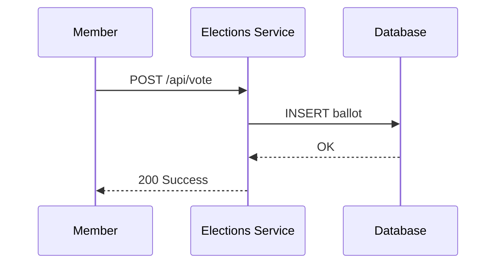

# Visual Documentation - Diagram Recommendations

**Created:** 2025-11-24
**Purpose:** Identify where diagrams, screenshots, and images would improve documentation
**Context:** Only 1.8% of markdown files (6/327) contain images

---

## 🎯 Executive Summary

**Current State:**
- **327 markdown files** analyzed
- **Only 6 files** have images (1.8%)
- **321 files** with no visual content (98.2%)
- **High code documentation** (76.5% contain code blocks)
- **Low visual documentation** (1.8% contain images)

**Impact:** Documentation is heavily text/code-focused. Adding visual elements would:
- Improve comprehension of complex flows
- Reduce onboarding time for new developers
- Make architecture more accessible
- Provide quick reference for non-technical stakeholders

**Recommendation:** Add **30-40 diagrams** to high-priority documentation files

---

## 📊 Current Files with Images

Only 6 files currently have images:

| File | Images | Type | Purpose |
|------|--------|------|---------|
| README.md | 2 | Project overview | Screenshots/badges |
| docs/development/guides/admin/MFA_ENFORCEMENT.md | 2 | Security guide | QR codes, UI screenshots |
| docs/development/CODE_PATTERN_CHECKS.md | 1 | Development guide | Example output |
| docs/development/guides/ADMIN_ELECTION_BACKEND_IMPLEMENTATION_CHECKLIST.md | 1 | Checklist | Architecture diagram |
| docs/architecture/ARCHITECTURE_RECOMMENDATIONS.md | 1 | Architecture | System diagram |
| archive/old-design-docs/ARCHITECTURE_RECOMMENDATIONS.md | 1 | Archive | System diagram |

**Insight:** Images are primarily in high-level docs (README, architecture). Technical implementation docs lack visual aids.

---

## 🔝 High Priority Files for Diagrams

### Priority 1: System Architecture & Infrastructure (7 files)

These files describe complex systems and would benefit most from visual diagrams.

#### 1. CLOUD_RUN_SERVICES.md (33 KB, 73 headings)

**Current:** Text description of 13 microservices
**Needed:** Architecture diagrams

**Recommended Diagrams:**

**A. Service Architecture Overview**
```
Type: Component Diagram
Tool: draw.io, Excalidraw, or Mermaid
Shows: All 13 services with their connections

┌─────────────────────────────────────────────────────────┐
│                    Client Layer                          │
├─────────────────────────────────────────────────────────┤
│  Member Portal  │  Admin Portal  │  Public Pages         │
└────────┬────────┴────────┬───────┴──────────┬───────────┘
         │                 │                   │
         ▼                 ▼                   ▼
┌─────────────────────────────────────────────────────────┐
│               Firebase (Auth, Firestore)                 │
└────────┬────────────────────────────────┬────────────────┘
         │                                 │
         ▼                                 ▼
┌────────────────────┐          ┌────────────────────┐
│  Elections Service │          │  Members Service   │
│  (PostgreSQL)      │          │  (Firestore)       │
└────────┬───────────┘          └─────────┬──────────┘
         │                                 │
         ▼                                 ▼
┌─────────────────────────────────────────────────────────┐
│              Django Backend (Linode)                     │
│              (PostgreSQL - socialism)                    │
└─────────────────────────────────────────────────────────┘
```

**B. Authentication Flow Diagram**
```
Type: Sequence Diagram
Shows: Kenni.is → Firebase → Services
```

**C. Cloud Run Service Map**
```
Type: Network Diagram
Shows: All 13 services with URLs, ports, dependencies
```

**Files to create:**
- `docs/infrastructure/diagrams/architecture-overview.png`
- `docs/infrastructure/diagrams/authentication-flow.png`
- `docs/infrastructure/diagrams/service-map.png`

---

#### 2. DJANGO_BACKEND_SYSTEM.md (36 KB, 101 headings)

**Current:** ✅ Has ASCII diagram (good!)
**Needed:** Enhanced visual diagrams

**Current ASCII diagram is excellent foundation. Enhance with:**

**A. API Flow Diagram**
```
Type: Sequence Diagram
Shows: Ekklesia → Django REST API → PostgreSQL

Member Portal                Django API               PostgreSQL
      │                          │                        │
      │  GET /api/members/me     │                        │
      ├─────────────────────────>│                        │
      │  (Firebase JWT)           │                        │
      │                          │  SELECT * FROM comrade │
      │                          ├───────────────────────>│
      │                          │                        │
      │                          │<───────────────────────┤
      │                          │  (member data)         │
      │<─────────────────────────┤                        │
      │  (JSON response)          │                        │
```

**B. Database Schema Diagram**
```
Type: Entity-Relationship Diagram
Shows: All Django tables and relationships
Focus: membership_comrade, membership_contactinfo, addresses, districts
```

**Files to create:**
- `docs/systems/diagrams/django-api-flow.png`
- `docs/systems/diagrams/django-schema.png`

---

#### 3. FIREBASE_APP_CHECK_RESEARCH.md (67 KB)

**Current:** Dense security research document
**Needed:** Security flow diagrams

**Recommended Diagrams:**

**A. App Check Flow**
```
Type: Sequence Diagram
Shows: Client → App Check → Backend → Firebase
```

**B. Attack Prevention Diagram**
```
Type: Threat Model Diagram
Shows: What attacks App Check prevents
- Bot traffic ❌
- Replay attacks ❌
- Unauthorized apps ❌
```

**Files to create:**
- `docs/security/diagrams/app-check-flow.png`
- `docs/security/diagrams/threat-model.png`

---

#### 4. VOTING_ANONYMITY_MODEL.md (29 KB, 54 headings)

**Current:** ✅ Has text-based flow diagrams (good!)
**Needed:** Visual sequence diagrams

**Current text diagrams are clear. Enhance with:**

**A. MVP Token Flow (Visual)**
```
Type: Sequence Diagram
Shows: Member → Events Service → Elections Service → Ballot Storage
Highlight: Anonymity preserved (no member_uid in ballots)
```

**B. Current Member Flow (Visual)**
```
Type: Sequence Diagram
Shows: Member → Elections Service → Ballot Storage (with member_uid)
Highlight: Database-level linkability
```

**C. Anonymization Process**
```
Type: State Diagram
Shows: Election lifecycle with anonymization
Draft → Published → Closed → Anonymized
```

**Files to create:**
- `docs/security/diagrams/voting-token-flow.png`
- `docs/security/diagrams/voting-member-flow.png`
- `docs/security/diagrams/anonymization-lifecycle.png`

---

#### 5. DJANGO_ADDRESS_SYSTEM_DEEP_DIVE.md (29 KB, 88 headings)

**Current:** ✅ Has ASCII schema diagram (good!)
**Needed:** Enhanced ER diagram

**A. Database Entity-Relationship Diagram**
```
Type: ER Diagram (proper visual)
Shows: 5 tables with relationships, foreign keys, cardinality
Tools: dbdiagram.io, draw.io

membership_comrade (1) ──────── (Many) membership_newcomradeaddress
                                              │
                                              │ (inherits)
                                              ▼
                                    membership_newlocaladdress
                                              │
                                              │ (Many:1)
                                              ▼
                                         map_address
                                              │
                                        ┌─────┴─────┐
                                        │           │
                                        ▼           ▼
                                  map_street    map_postalcode
                                        │
                                        ▼
                                  map_municipality
```

**B. API Serializer Flow**
```
Type: Data Flow Diagram
Shows: Django Model → DRF Serializer → JSON → Firestore
```

**Files to create:**
- `docs/integration/diagrams/address-schema-er.png`
- `docs/integration/diagrams/address-serializer-flow.png`

---

#### 6. GDPR_VOTING_ANONYMITY_ANALYSIS.md (32 KB, 57 headings)

**Current:** Legal/compliance analysis
**Needed:** Decision tree diagrams

**A. GDPR Compliance Decision Tree**
```
Type: Flowchart
Shows: When to anonymize, when to retain data, legal basis
```

**B. Data Lifecycle Diagram**
```
Type: State Diagram
Shows: Personal data → Voting → Anonymization → Retention → Deletion
With: GDPR timelines and requirements
```

**Files to create:**
- `docs/security/diagrams/gdpr-compliance-tree.png`
- `docs/security/diagrams/data-lifecycle.png`

---

#### 7. CURRENT_DEVELOPMENT_STATUS.md (39 KB, 59 headings)

**Current:** Text-based roadmap
**Needed:** Visual timeline/roadmap

**A. Project Roadmap (Gantt-style)**
```
Type: Timeline Diagram
Shows: Phases, completed work, current work, planned work
Visual: Green (✅ Done) | Yellow (🔄 In Progress) | Gray (⏸️ Planned)

Phase 1 ████████████ 100% ✅
Phase 2 ████████████ 100% ✅
Phase 3 ██████░░░░░░  60% 🔄
Phase 4 ░░░░░░░░░░░░   0% ⏸️
Phase 5 ░░░░░░░░░░░░   0% ⏸️
```

**B. Architecture Evolution Diagram**
```
Type: Timeline + Architecture
Shows: How system architecture evolved from Phase 1 → Phase 5
```

**Files to create:**
- `docs/status/diagrams/project-roadmap.png`
- `docs/status/diagrams/architecture-evolution.png`

---

### Priority 2: Component & Feature Documentation (5 files)

#### 8. apps/members-portal/js/components/README.md (27 KB, 34 headings)

**Needed:** Component relationship diagram

**A. Component Dependency Graph**
```
Type: Network Diagram
Shows: Which components depend on which
Example:
  voting-form.js
       │
       ├──> modal.js
       ├──> badge.js
       └──> countdown-timer.js
```

**B. Component Lifecycle Diagram**
```
Type: State Diagram
Shows: Component initialization → interaction → cleanup
```

**Files to create:**
- `apps/members-portal/js/components/diagrams/component-dependencies.png`
- `apps/members-portal/js/components/diagrams/component-lifecycle.png`

---

#### 9. Election Feature Guide (Split into 6 checklists) ✅ **COMPLETED 2025-11-24**

**Status:** Original ELECTION_FEATURE_CHECKLIST.md (1,441 lines) has been split into 6 focused checklists.

**Still Needed:** Development workflow diagram

**A. Feature Development Workflow**
```
Type: Flowchart
Shows: Requirements → i18n → Components → Testing → Deployment
With decision points: "Reuse existing component?" "A11y requirements met?"
```

**Files to create:**
- `docs/development/guides/election-feature/diagrams/feature-workflow.png` (add to OVERVIEW.md)

---

### Priority 3: Testing & Deployment (3 files)

#### 10. QUALITY_TESTING_GUIDE.md (43 TODOs)

**Needed:** Testing pyramid diagram

**A. Testing Strategy Pyramid**
```
Type: Pyramid Diagram
Shows:
       /\
      /  \  E2E Tests (5%)
     /----\
    / Unit \ Integration Tests (35%)
   /--------\
  /  Manual  \ Unit Tests (60%)
 /------------\
```

**Files to create:**
- `docs/standards/diagrams/testing-pyramid.png`

---

#### 11. DEPLOYMENT.md (42 TODOs)

**Needed:** Deployment pipeline diagram

**A. CI/CD Pipeline**
```
Type: Flowchart
Shows: Git Push → GitHub Actions → Build → Test → Deploy → Verify
With: Rollback procedures
```

**Files to create:**
- `docs/integration/diagrams/deployment-pipeline.png`

---

### Priority 4: User Journeys (3 files)

#### 12. Member Authentication Flow

**Needed:** User journey diagram

**A. Login Flow (with screenshots)**
```
Type: User Journey + Screenshots
Shows: Landing page → Kenni.is → Redirect → Member portal
```

**Files to create:**
- `docs/features/diagrams/member-login-journey.png`
- `docs/features/screenshots/login-*.png` (actual screenshots)

---

#### 13. Voting Flow

**Needed:** User journey diagram

**A. Vote Casting Flow (with screenshots)**
```
Type: User Journey + Screenshots
Shows: Elections list → Election detail → Vote confirmation → Success
```

**Files to create:**
- `docs/features/diagrams/voting-journey.png`
- `docs/features/screenshots/voting-*.png` (actual screenshots)

---

## 🛠️ Recommended Tools

### For Creating Diagrams

#### 1. **Mermaid.js** (Recommended for docs in Git)
**Why:** Text-based, version-controllable, renders in GitHub/GitLab

**Example:**


**Integration:**
- Add mermaid code blocks to markdown
- GitHub renders automatically
- Can export to PNG/SVG

**Pros:** ✅ Version control, ✅ Easy updates, ✅ No external tools
**Cons:** ❌ Limited styling

---

#### 2. **draw.io / diagrams.net** (Recommended for complex diagrams)
**Why:** Free, powerful, exports to PNG/SVG, integrates with GitHub

**Best for:**
- Architecture diagrams
- Complex ER diagrams
- Network diagrams

**Workflow:**
```bash
# 1. Create diagram at app.diagrams.net
# 2. Export as PNG and XML (source)
# 3. Store both in Git:
docs/systems/diagrams/
├── architecture.png      (displayed in docs)
└── architecture.drawio   (editable source)
```

**Pros:** ✅ Professional quality, ✅ Many templates
**Cons:** ❌ Binary files (no text diff)

---

#### 3. **Excalidraw** (Recommended for quick sketches)
**Why:** Hand-drawn style, very quick, open source

**Best for:**
- Quick concept diagrams
- Informal flows
- Brainstorming visuals

**Pros:** ✅ Fast, ✅ Friendly appearance
**Cons:** ❌ Less formal

---

#### 4. **dbdiagram.io** (Recommended for database schemas)
**Why:** Specialized for ER diagrams, clean output

**Example:**
```dbml
Table comrade {
  id integer [primary key]
  name varchar
  kennitala varchar [unique]
}

Table address {
  id integer [primary key]
  comrade_id integer [ref: > comrade.id]
  street varchar
}
```

**Pros:** ✅ Clean ER diagrams, ✅ Export SQL
**Cons:** ❌ Only for databases

---

#### 5. **Screenshots** (Use for UI documentation)

**Tools:**
- macOS: Cmd+Shift+4
- Linux: Flameshot, Spectacle
- Browser: DevTools device emulation

**Best Practices:**
- Use consistent window sizes (1440x900)
- Annotate with arrows/boxes (Flameshot, Skitch)
- Crop to relevant area
- Compress images (TinyPNG, ImageOptim)

---

## 📐 Diagram Standards

### File Naming Convention
```
docs/{category}/diagrams/{description}-{type}.{ext}

Examples:
docs/systems/diagrams/django-architecture-system.png
docs/security/diagrams/voting-flow-sequence.png
docs/infrastructure/diagrams/cloud-run-services-component.png
```

### Source Files
Always keep editable source files:
```
docs/systems/diagrams/
├── django-architecture-system.png       (displayed)
├── django-architecture-system.drawio    (editable)
└── django-architecture-system.mermaid   (if using mermaid)
```

### Image Formats
- **PNG:** For diagrams with text (better compression)
- **SVG:** For scalable diagrams (best for web)
- **JPG:** For screenshots (smaller file size)

### Image Sizes
- **Max width:** 1200px (readable on all screens)
- **Recommended:** 800-1000px width
- **Compress:** Use TinyPNG or ImageOptim

---

## 📋 Implementation Checklist

### Phase 1: Infrastructure Diagrams (Week 1)
- [ ] Create `docs/infrastructure/diagrams/` directory
- [ ] CLOUD_RUN_SERVICES.md - Architecture overview (draw.io)
- [ ] CLOUD_RUN_SERVICES.md - Authentication flow (mermaid)
- [ ] DJANGO_BACKEND_SYSTEM.md - API flow (mermaid)
- [ ] DJANGO_BACKEND_SYSTEM.md - Database schema (dbdiagram.io)

### Phase 2: Security & Compliance Diagrams (Week 2)
- [ ] Create `docs/security/diagrams/` directory
- [ ] VOTING_ANONYMITY_MODEL.md - Token flow (mermaid)
- [ ] VOTING_ANONYMITY_MODEL.md - Member flow (mermaid)
- [ ] GDPR_VOTING_ANONYMITY_ANALYSIS.md - Compliance tree (draw.io)
- [ ] FIREBASE_APP_CHECK_RESEARCH.md - Security flow (mermaid)

### Phase 3: Component & Development Diagrams (Week 3)
- [ ] Create `apps/members-portal/js/components/diagrams/` directory
- [ ] Component README - Dependency graph (mermaid)
- [ ] Election Feature OVERVIEW.md - Workflow diagram (draw.io)
- [ ] CURRENT_DEVELOPMENT_STATUS.md - Project roadmap (draw.io)

### Phase 4: User Journeys & Screenshots (Week 4)
- [ ] Create `docs/features/diagrams/` directory
- [ ] Create `docs/features/screenshots/` directory
- [ ] Capture login flow screenshots (5-7 images)
- [ ] Capture voting flow screenshots (5-7 images)
- [ ] Create annotated user journey diagrams

---

## ✅ Success Metrics

**Before:**
- 6 files with images (1.8%)
- 0 architecture diagrams
- 0 user flow diagrams

**After (Target):**
- 35+ files with images (10%)
- 15+ architecture/system diagrams
- 10+ flow/sequence diagrams
- 10+ user journey diagrams/screenshots

**Impact:**
- Reduced onboarding time (estimate: -30%)
- Improved comprehension (easier to understand complex systems)
- Better stakeholder communication (non-technical audiences)

---

## 🔗 Related Documentation

- [Markdown Insights](../../tmp/github-issues/MARKDOWN_INSIGHTS.md) - Full markdown analysis
- [TODO Cleanup Strategy](./TODO_CLEANUP_STRATEGY.md) - Overall TODO management
- [Checklist Splitting Recommendations](./CHECKLIST_SPLITTING_RECOMMENDATIONS.md) - Breaking down large checklists

---

## 💡 Tips & Best Practices

### For System Architecture Diagrams
- Use consistent shapes (rectangles for services, cylinders for databases)
- Include URLs and ports
- Show data flow with arrows
- Use colors to group related components

### For Sequence Diagrams
- Keep to 4-6 participants max
- Show error paths (not just happy path)
- Include HTTP status codes
- Annotate with security boundaries

### For ER Diagrams
- Show cardinality (1:1, 1:Many, Many:Many)
- Include primary keys (PK) and foreign keys (FK)
- Use crow's foot notation
- Highlight critical relationships

### For Screenshots
- Use consistent browser/window size
- Hide sensitive data (emails, kennitala, etc.)
- Annotate with arrows/boxes for clarity
- Compress images before committing

---

**Last Updated:** 2025-11-24
**Implementation Status:** Planning Phase
**Diagrams Created:** 0/35 (target)
**Estimated Effort:** 4 weeks (1-2 hours/day)
