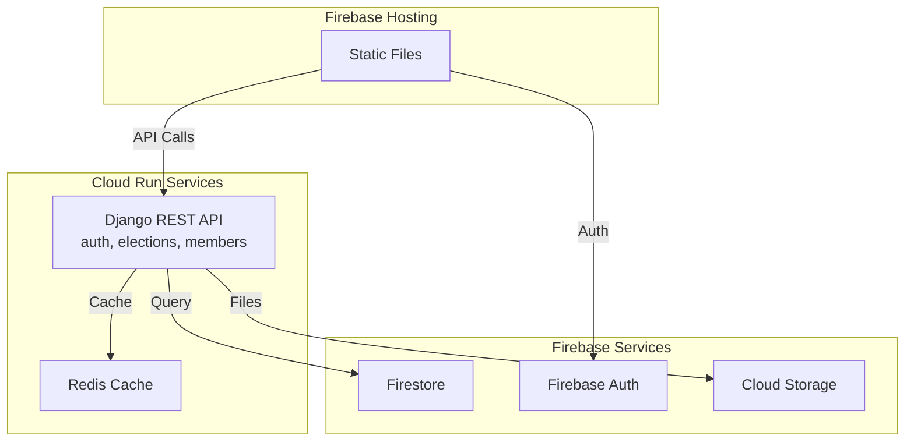

# Documentation Quality Implementation Plan

**Created:** 2025-11-24
**Status:** Active
**Duration:** 4 weeks (2025-11-24 to 2025-12-22)
**Goal:** Improve documentation quality from 40/100 (Grade D) to 70+/100 (Grade B)

---

## 📊 Current Baseline

**Metrics (as of 2025-11-24):**
- TODO Health Score: 40/100 (Grade: D - Critical)
- Total TODOs: 2,065
- Unchecked TODOs: 1,780 (86.2%)
- Completion Rate: 13.8%
- Files with TODOs: 100 files
- TODO-heavy files (>20): 34 files
- Files with images: 6/327 (1.8%)
- Markdown files: 327 (278,839 lines, 10.55 MB)

**Target Metrics (Week 4):**
- TODO Health Score: 70+/100 (Grade: B)
- Unchecked TODOs: <800 (55% reduction)
- Completion Rate: >30%
- TODO-heavy files: <15 files
- Files with images: 35+ (10%)

---

## 🎯 Implementation Strategy

### Phase 1: Foundation & Quick Wins (Week 1)
**Focus:** Establish baseline, archive obsolete files, quick TODO reductions

### Phase 2: TODO Consolidation (Week 2)
**Focus:** Split large checklists, consolidate duplicates, mark completed items

### Phase 3: Visual Documentation (Week 3)
**Focus:** Add diagrams to high-priority files, improve navigation

### Phase 4: Standards & Maintenance (Week 4)
**Focus:** Create style guides, set up automation, verify improvements

---

## 📅 Week 1: Foundation & Quick Wins (2025-11-24 to 2025-12-01)

### Day 1-2: Baseline & Assessment

**1.1 Run TODO Health Analysis**
```bash
python3 scripts/maintenance/check-todo-health.py --verbose > tmp/analysis/todo-health-baseline-2025-11-24.txt
python3 scripts/maintenance/analyze_md_insights.py > tmp/analysis/markdown-insights-baseline-2025-11-24.txt
```

**1.2 Review Historical Test Files**
- Read `docs/testing/I18N_POST_DEPLOYMENT_TEST_2025-11-05.md`
- Determine if test was completed
- **Action:** Archive to `docs/testing/archive/` OR create GitHub Issue
- **Expected reduction:** -61 TODOs

**1.3 Identify Completed Work**
- Review git log for last 90 days
- Find features that were implemented but TODOs not checked
- **Target:** Mark 100+ completed TODOs

### Day 3-4: Archive & Clean Up

**1.4 Archive Obsolete Files**
- Move completed historical checklists to archive/
- Add archive README explaining what's archived and why
- **Target files:**
  - Historical deployment tests (if completed)
  - Old planning documents superseded by new structure
  - Completed feature checklists

**1.5 Create Archive Structure**
```bash
mkdir -p docs/archive/{features,testing,planning}
mkdir -p docs/archive/README.md
```

**1.6 Delete Duplicate TODOs**
- Find TODOs duplicated across files
- Consolidate into single canonical location
- Add cross-references
- **Target:** -50 TODOs

### Day 5: Week 1 Wrap-up

**1.7 Run Updated Metrics**
```bash
python3 scripts/maintenance/check-todo-health.py --verbose
```

**1.8 Create Week 1 Report**
- Document TODOs reduced
- Files archived
- Completion rate improvement
- **Expected metrics:**
  - Unchecked TODOs: 1,780 → 1,550 (-230)
  - Completion rate: 13.8% → 18%

---

## 📅 Week 2: TODO Consolidation (2025-12-01 to 2025-12-08)

### Day 1-2: Code Quality Consolidation

**2.1 Consolidate CODE_QUALITY Files**
- Read both `CODE_QUALITY_IMPROVEMENT_PLAN.md` and `CODE_QUALITY_CHECKLIST.md`
- Compare TODOs, identify duplicates and completed items
- Merge into single source of truth

**2.2 Split CODE_QUALITY into Phases**
```
docs/development/code-quality/
├── OVERVIEW.md (progress dashboard)
├── PHASE_1_SECURITY.md (~15 TODOs)
├── PHASE_2_PYTHON_LOGGING.md (~12 TODOs)
├── PHASE_3_JAVASCRIPT.md (~10 TODOs)
├── PHASE_4_DOCUMENTATION.md (~8 TODOs)
└── PHASE_5_CSS.md (COMPLETED ✅)
```

**Expected reduction:** 60 TODOs → 45 active (consolidate duplicates, mark completed)

### Day 3-4: Epic Migration to GitHub

**2.3 Create GitHub Epic Issues**

**Epic 87: Election Discovery**
```bash
gh issue create \
  --title "Epic 87: Election Discovery & Browse UI" \
  --body "$(cat docs/features/election-voting/EPIC_87_ELECTION_DISCOVERY.md)" \
  --label "epic,enhancement,elections,phase-6" \
  --milestone "Phase 6"
```

**Epic 24: Admin Lifecycle**
```bash
gh issue create \
  --title "Epic 24: Election Admin Lifecycle Management" \
  --body "$(cat docs/features/election-voting/EPIC_24_ADMIN_LIFECYCLE.md)" \
  --label "epic,enhancement,elections,admin,phase-6" \
  --milestone "Phase 6"
```

**2.4 Create Sub-Issues**
- Break each epic into 5-8 sub-issues
- Create GitHub Project board for tracking
- Simplify markdown files to high-level overviews

**2.5 Update Epic Markdown Files**
```markdown
# Epic 87: Election Discovery

**Status:** Planned
**GitHub Issue:** #XXX
**Project Board:** [Election Features](https://github.com/...)

## Overview
[Brief description]

## Key Milestones
- [ ] Backend API complete
- [ ] Frontend UI complete
- [ ] Testing complete
- [ ] Documentation complete

For detailed task breakdown, see GitHub Issue #XXX.
```

**Expected reduction:** 103 TODOs → moved to GitHub Issues

### Day 5: Week 2 Wrap-up

**2.6 Run Updated Metrics**
```bash
python3 scripts/maintenance/check-todo-health.py --verbose
```

**2.7 Create Week 2 Report**
- **Expected metrics:**
  - Unchecked TODOs: 1,550 → 1,200 (-350)
  - Completion rate: 18% → 25%
  - TODO-heavy files: 34 → 22

---

## 📅 Week 3: Visual Documentation (2025-12-08 to 2025-12-15)

### Day 1-2: Infrastructure Diagrams

**3.1 CLOUD_RUN_SERVICES.md - Architecture Diagram**


**3.2 DJANGO_BACKEND_SYSTEM.md - API Flow Diagram**
- Request flow diagram
- Authentication sequence
- Database schema (ER diagram)

**3.3 FIREBASE_AUTHENTICATION.md - Auth Flow**
- Login sequence diagram
- Token refresh flow
- Role-based access control

**Target:** Add diagrams to 7 infrastructure files

### Day 3-4: Component & Security Diagrams

**3.4 Component Documentation**
- Modal component state diagram
- Election voting flow diagram
- Form validation flowchart

**3.5 Security Diagrams**
- RBAC authorization flow
- Input validation pipeline
- Secrets management architecture

**Target:** Add diagrams to 9 more files (total 16)

### Day 5: User Journey Screenshots

**3.6 Add Screenshots**
- Member registration flow
- Election voting process
- Admin election management
- Policy session participation

**3.7 Week 3 Wrap-up**
- **Expected metrics:**
  - Files with images: 6 → 22 (6.7%)
  - Visual documentation coverage up significantly

---

## 📅 Week 4: Standards & Maintenance (2025-12-15 to 2025-12-22)

### Day 1-2: Documentation Standards

**4.1 Create Frontmatter Standard**
```markdown
---
title: "Document Title"
created: 2025-11-24
updated: 2025-11-24
status: active | archived | deprecated
category: architecture | development | features | testing
tags: [tag1, tag2, tag3]
related:
  - path/to/related.md
  - path/to/other.md
---
```

**4.2 Add Frontmatter to Key Docs (30 files)**
- All architecture docs (12 files)
- All feature guides (8 files)
- All standards docs (10 files)

**4.3 Create Heading Style Guide**
```markdown
# Document Title (Title Case)
## Section Heading (Sentence case)
### Subsection heading (Sentence case)
```

**4.4 Apply Heading Standards**
- Run automated check
- Fix inconsistencies in top 50 files

### Day 3-4: Automation & Verification

**4.5 Set Up Weekly TODO Report**
- Create GitHub Action workflow
- Weekly email report with metrics
- Automated stale TODO detection

**4.6 Create Git Pre-commit Hook**
```bash
# .git/hooks/pre-commit
# Check for TODOs in commits > 50 lines
# Suggest creating GitHub Issue instead
```

**4.7 Update Documentation Maintenance Scripts**
- Add TODO health to freshness check
- Alert on files with >30 unchecked TODOs
- Weekly reminder to review completion rates

### Day 5: Final Verification & Report

**4.8 Run Final Metrics**
```bash
python3 scripts/maintenance/check-todo-health.py --verbose > tmp/analysis/todo-health-final-2025-12-22.txt
python3 scripts/maintenance/analyze_md_insights.py > tmp/analysis/markdown-insights-final-2025-12-22.txt
```

**4.9 Create Implementation Report**
```markdown
# Documentation Quality Implementation Report

## Metrics Improvement
| Metric | Baseline | Target | Actual | Status |
|--------|----------|--------|--------|--------|
| TODO Health Score | 40/100 | 70+/100 | XX/100 | ✅/❌ |
| Unchecked TODOs | 1,780 | <800 | XXX | ✅/❌ |
| Completion Rate | 13.8% | >30% | XX% | ✅/❌ |
| TODO-heavy files | 34 | <15 | XX | ✅/❌ |
| Files with images | 6 | 35+ | XX | ✅/❌ |

## Work Completed
- Files archived: XX
- TODOs migrated to GitHub: XX
- Diagrams added: XX
- Standards created: XX
```

**4.10 Update All Strategy Documents**
- Mark completed sections
- Update next steps
- Document lessons learned

---

## 🎯 Success Criteria

### Critical (Must Achieve)
- ✅ TODO Health Score: 70+/100
- ✅ Unchecked TODOs: <800 (55% reduction)
- ✅ Files archived: I18N_POST_DEPLOYMENT_TEST + others
- ✅ ELECTION_FEATURE_CHECKLIST split: COMPLETED ✅
- ✅ CODE_QUALITY files consolidated and split

### Important (Should Achieve)
- ✅ Completion Rate: >30%
- ✅ TODO-heavy files: <15
- ✅ GitHub Issues created for Epics 87 & 24
- ✅ Infrastructure diagrams: 7 files
- ✅ Total visual documentation: 20+ files

### Nice to Have (Could Achieve)
- ✅ Files with images: 35+ (10%)
- ✅ Frontmatter added to 30+ key docs
- ✅ Heading style guide implemented
- ✅ Weekly TODO report automation
- ✅ Pre-commit TODO checks

---

## 📋 Daily Checklist Template

### Morning
- [ ] Review previous day's progress
- [ ] Check current TODO health score
- [ ] Prioritize today's 3 main tasks

### Afternoon
- [ ] Complete at least 2 main tasks
- [ ] Update progress in implementation plan
- [ ] Commit changes with descriptive messages

### Evening
- [ ] Run TODO health check
- [ ] Document any blockers
- [ ] Plan next day's work

---

## 🚧 Risk Management

### Risk 1: Time Overrun
**Mitigation:** Focus on Critical success criteria first. Skip Nice to Have items if needed.

### Risk 2: Discovering More Obsolete Files
**Mitigation:** Create clear archive criteria. When in doubt, archive (can always restore).

### Risk 3: GitHub API Rate Limits
**Mitigation:** Batch issue creation. Use `gh` CLI with authentication. Spread over multiple days.

### Risk 4: Merge Conflicts
**Mitigation:** Commit and push frequently. Coordinate with team if working in same areas.

### Risk 5: Tool Failures
**Mitigation:** All scripts have error handling. Run manually if automation fails.

---

## 📊 Tracking & Reporting

### Weekly Reports
Create report after each week:
```markdown
# Week X Implementation Report (DATE)

## Completed
- [ ] Task 1
- [ ] Task 2

## Metrics
- TODO Health: XX/100 (was YY/100)
- Unchecked TODOs: XX (was YY)
- Completion Rate: XX% (was YY%)

## Blockers
- Issue 1 (resolved/pending)

## Next Week
- Priority 1
- Priority 2
```

### Tools
- `check-todo-health.py` - Run daily
- `analyze_md_insights.py` - Run weekly
- Git commit messages - Track all changes
- GitHub Issues - Track epic migration

---

## 🔗 Related Documentation

- [TODO Cleanup Strategy](./TODO_CLEANUP_STRATEGY.md)
- [Checklist Splitting Recommendations](./CHECKLIST_SPLITTING_RECOMMENDATIONS.md)
- [Diagram Recommendations](./DIAGRAM_RECOMMENDATIONS.md)
- [Markdown Insights](../../tmp/github-issues/MARKDOWN_INSIGHTS.md)

---

## 📞 Questions & Support

**Who executes this plan?**
Development team, coordinated daily

**How to report progress?**
Update this document daily, create weekly reports

**What if we fall behind schedule?**
Focus on Critical success criteria, defer Nice to Have items

**Can we adjust the plan?**
Yes! Update this document with rationale for changes

---

**Created:** 2025-11-24
**Owner:** Development Team
**Review Frequency:** Daily progress, weekly metrics
**Next Review:** 2025-12-01 (Week 1 completion)
**Final Review:** 2025-12-22 (Week 4 completion)
