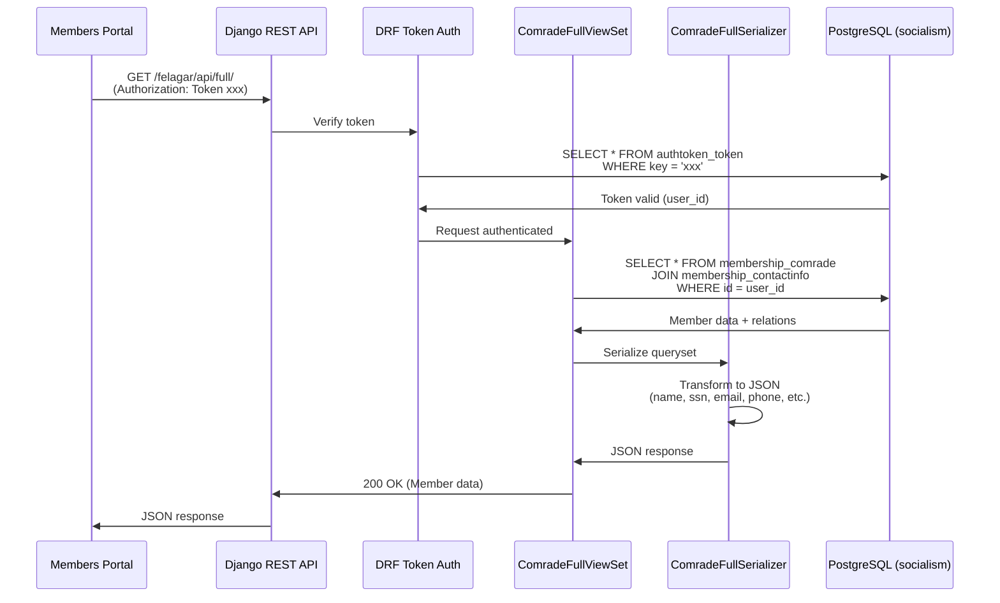
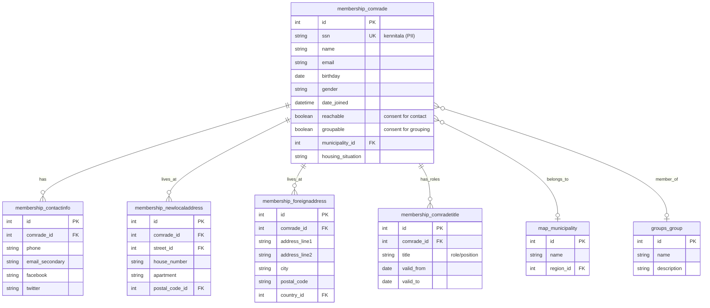

# Django Backend System Documentation

**Document Type**: System Reference
**Last Updated**: 2025-12-01
**Status**: ✅ Active - Deployed System
**Purpose**: Complete documentation of the Django membership management backend

---

## Overview

The Django backend system is the **source of truth** for Sósíalistaflokkur Íslands member data. It runs on a separate Linode server and provides a REST API for the Ekklesia system to consume member information for authentication, voting eligibility, and profile management.

**Key Facts:**
- **Technology**: [Django 1.11](https://docs.djangoproject.com/en/1.11/) ([Python 3](https://www.python.org/))
- **Server**: Linode VPS at 172.105.71.207
- **Domain**: https://starf.sosialistaflokkurinn.is
- **Database**: [PostgreSQL](https://www.postgresql.org/) (database name: `socialism`)
- **Web Server**: [Nginx](https://nginx.org/) + [Gunicorn](https://gunicorn.org/) (Unix socket)
- **Current Members**: 2,113 active members (as of December 2025)

---

## System Architecture

```
┌─────────────────────────────────────────────────────────────────┐
│ Linode Server: 172.105.71.207                                   │
│ Domain: starf.sosialistaflokkurinn.is                           │
├─────────────────────────────────────────────────────────────────┤
│                                                                  │
│  ┌──────────────┐         ┌──────────────┐                     │
│  │    Nginx     │────────▶│  Gunicorn    │                     │
│  │  Port: 80    │         │  3 workers   │                     │
│  │  Port: 443   │         │  Unix socket │                     │
│  └──────────────┘         └──────┬───────┘                     │
│         │                         │                              │
│         │                         ▼                              │
│         │                  ┌─────────────┐                      │
│         │                  │   Django    │                      │
│         │                  │  App Server │                      │
│         │                  │ (socialism) │                      │
│         │                  └──────┬──────┘                      │
│         │                         │                              │
│         │                         ▼                              │
│         │                  ┌─────────────┐                      │
│         │                  │ PostgreSQL  │                      │
│         │                  │   Database  │                      │
│         │                  │  (socialism)│                      │
│         │                  └─────────────┘                      │
│         │                                                        │
│  ┌──────▼──────────────────────────────────────────────┐       │
│  │              Static Files                            │       │
│  │  /home/manager/socialism/static/                    │       │
│  │  /home/manager/socialism/media/                     │       │
│  └─────────────────────────────────────────────────────┘       │
│                                                                  │
└─────────────────────────────────────────────────────────────────┘

              ▲
              │ HTTPS REST API
              │
    ┌─────────┴──────────┐
    │  Ekklesia System   │
    │  (GCP/Firebase)    │
    │                    │
    │  - Members Service │
    │  - Admin Portal    │
    └────────────────────┘
```

---

## Service Components

### 1. Nginx Web Server

**Configuration**: `/etc/nginx/sites-available/socialism`

**Key Features:**
- HTTP → HTTPS redirect (301 Permanent)
- SSL/TLS termination
- Reverse proxy to Gunicorn Unix socket
- Static file serving
- URL routing to Django application

**Status Check:**
```bash
~/django-ssh.sh "systemctl status nginx --no-pager | head -20"
```

**Expected Output:**
```
● nginx.service - A high performance web server and a reverse proxy server
   Loaded: loaded (/lib/systemd/system/nginx.service; enabled)
   Active: active (running) since [DATE]
```

**URL Routing:**
- `/felagar/*` → Django membership app
- `/admin/*` → Django admin interface
- `/media/*` → User uploaded files
- `/static/*` → Static assets (CSS, JS, images)

---

### 2. Gunicorn Application Server

**Service**: `gunicorn.service`

**Configuration:**
- **Workers**: 3 (Python processes)
- **Timeout**: 300 seconds
- **Binding**: Unix socket at `/run/gunicorn.sock`
- **User**: `manager`
- **Working Directory**: `/home/manager/socialism`
- **Python**: Virtual environment at `/home/manager/socialism/venv`

**Status Check:**
```bash
~/django-ssh.sh "systemctl status gunicorn --no-pager | head -20"
```

**Expected Output:**
```
● gunicorn.service - gunicorn daemon
   Loaded: loaded (/etc/systemd/system/gunicorn.service; disabled)
   Active: active (running)
 Main PID: [PID] (gunicorn)
    Tasks: 4 (1 master + 3 workers)
```

**Logs:**
- **Access logs**: stdout (via systemd journal)
- **Error logs**: `/home/manager/log/gunicorn/error.log`

**View Recent Errors:**
```bash
~/django-ssh.sh "tail -50 /home/manager/log/gunicorn/error.log | grep -E '(ERROR|CRITICAL|Exception)'"
```

**Restart Service:**
```bash
~/django-ssh.sh "sudo systemctl restart gunicorn && sleep 3 && sudo systemctl status gunicorn | head -15"
```

---

### 3. Django Application

**Project**: `socialism`
**App**: `membership` (main member management app)

**Project Structure:**
```
/home/manager/socialism/
├── socialism/              # Django project settings
│   ├── settings.py        # Main configuration
│   ├── urls.py            # Root URL routing
│   └── wsgi.py            # WSGI application entry point
├── membership/            # Member management app (Epic #43 focus)
│   ├── models.py          # Comrade, ContactInfo, etc.
│   ├── views.py           # ViewSets including ComradeFullViewSet
│   ├── serializers.py     # ComradeFullSerializer (Epic #116)
│   ├── urls.py            # API routes (/api/full/)
│   └── templates/         # HTML templates
├── venv/                  # Python virtual environment
├── static/                # Static files (CSS, JS)
├── media/                 # User uploads
└── manage.py              # Django management command
```

**Key Settings:**
- **Django Version**: 1.11.x (legacy, requires Python 3.6-3.7)
- **Database**: PostgreSQL via `psycopg2`
- **REST Framework**: Django REST Framework (DRF)
- **Authentication**: Token-based (DRF TokenAuthentication)

**Management Commands:**
```bash
# Check Django configuration
~/django-ssh.sh "cd /home/manager/socialism && sudo -u manager venv/bin/python manage.py check"

# Create database migrations
~/django-ssh.sh "cd /home/manager/socialism && sudo -u manager venv/bin/python manage.py makemigrations"

# Apply migrations
~/django-ssh.sh "cd /home/manager/socialism && sudo -u manager venv/bin/python manage.py migrate"

# Create superuser (interactive)
~/django-ssh.sh "cd /home/manager/socialism && sudo -u manager venv/bin/python manage.py createsuperuser"

# Django shell (interactive)
~/django-ssh.sh "cd /home/manager/socialism && sudo -u manager venv/bin/python manage.py shell"
```

---

### 4. PostgreSQL Database

**Database Name**: `socialism`
**User**: `postgres`
**Port**: 5432 (default)

**Schema Structure:**

```sql
-- Core membership tables
membership_comrade          -- Member records (2,166 total)
membership_contactinfo      -- Contact details (email, phone, Facebook)
membership_newlocaladdress  -- Icelandic addresses
membership_foreignaddress   -- International addresses
membership_comradetitle     -- Member roles/titles
membership_unionmembership  -- Union affiliations

-- Geographic reference data
map_continent
map_country
map_region
map_postalcode
map_municipality
map_street

-- Other modules
groups_*                    -- Member groups
cells_*                     -- Local cells
action_*                    -- Actions/events
communication_*             -- Email/SMS
economy_*                   -- Payments
conscience_*                -- Conscience objections
elections_*                 # Voting (separate from Ekklesia)
```

**Key Table: membership_comrade**

Columns (partial list):
- `id` (integer, primary key)
- `ssn` (varchar, kennitala/ID number) **⚠️ PII - Sensitive**
- `name` (varchar, full name)
- `birthday` (date)
- `gender` (varchar, choices)
- `date_joined` (datetime)
- `reachable` (boolean, consent for contact)
- `groupable` (boolean, consent for grouping)
- `housing_situation` (varchar)

**Database Queries:**

```bash
# Count total real members (exclude test accounts)
~/django-ssh.sh "cd /home/manager/socialism && sudo -u postgres psql -U postgres -d socialism -c \"SELECT COUNT(*) as total_members FROM membership_comrade WHERE ssn NOT LIKE '9999%';\""

# Count test accounts (SSN starts with 9999)
~/django-ssh.sh "cd /home/manager/socialism && sudo -u postgres psql -U postgres -d socialism -c \"SELECT COUNT(*) as test_accounts FROM membership_comrade WHERE ssn LIKE '9999%';\""

# Get member by kennitala (example with fake SSN)
~/django-ssh.sh "cd /home/manager/socialism && sudo -u postgres psql -U postgres -d socialism -c \"SELECT id, name, ssn, date_joined FROM membership_comrade WHERE ssn = 'XXXXXX-XXXX';\""

# Check database tables
~/django-ssh.sh "cd /home/manager/socialism && sudo -u postgres psql -U postgres -d socialism -c \"\dt\" | head -30"
```

**Important Notes:**
- **Test Accounts**: SSNs starting with `9999` are fake/test accounts (59 total)
- **Real Members**: 2,107 active members as of 2025-10-28
- **PII Protection**: SSN field contains Icelandic kennitala (personal ID numbers)
- **Data Integrity**: Foreign key constraints enforce referential integrity

---

## API Flow Diagrams

Visual representations of how the Django backend handles API requests and the database schema structure.

### API Request Flow

This sequence diagram shows the complete flow of an API request from the Members Portal to the Django backend:



**Key Steps:**
1. **Authentication**: Portal sends request with DRF token in Authorization header
2. **Token Verification**: Django verifies token against `authtoken_token` table
3. **Database Query**: ComradeFullViewSet queries `membership_comrade` table with JOINs
4. **Serialization**: ComradeFullSerializer transforms database rows to JSON
5. **Response**: Django returns JSON response with member data

**Security Notes:**
- Token is 40-character hex string stored in GCP Secret Manager
- All requests require valid token (401 Unauthorized if missing/invalid)
- SSN (kennitala) is PII and should be handled securely
- Firebase Auth verification happens before Django API call

### Database Schema Overview

This entity-relationship diagram shows the core tables in the `socialism` database:



**Key Relationships:**
- **membership_comrade**: Central member table (2,107 active members)
- **membership_contactinfo**: One-to-many contact details (phone, email, social media)
- **Addresses**: Members can have local (Icelandic) or foreign addresses
- **Titles**: Members can have multiple roles/positions over time
- **Geographic Data**: Municipality references for Icelandic members
- **Groups**: Many-to-many relationship for member groups/cells

**Data Types:**
- `PK` = Primary Key
- `FK` = Foreign Key
- `UK` = Unique Key
- All PII fields (ssn, email, phone) should be handled according to GDPR/data protection policies

---

## REST API (Epic #43 Integration)

### API Endpoint

**Base URL**: `https://starf.sosialistaflokkurinn.is/felagar/api/`

**Full Member List Endpoint**: `https://starf.sosialistaflokkurinn.is/felagar/api/full/`

### Authentication

**Type**: Token Authentication (Django REST Framework)

**Header Format:**
```
Authorization: Token <40-character-hex-token>
```

**Token Storage**: Google Cloud Secret Manager
```bash
# Retrieve token
export DJANGO_API_TOKEN=$(gcloud secrets versions access latest --secret="django-api-token" --project=ekklesia-prod-10-2025)

# Token format: 40 hex characters
# Example: 488ae868c569a65c832927de0ff84c1ba61e266d
```

**Security Notes:**
- Token is stored in GCP Secret Manager (`django-api-token`)
- Never commit token to git
- Token required for all API requests
- No token = 401 Unauthorized response

### API Testing

**Health Check:**
```bash
export DJANGO_API_TOKEN=$(gcloud secrets versions access latest --secret="django-api-token" --project=ekklesia-prod-10-2025)

~/django-ssh.sh "curl -s -H 'Authorization: Token $DJANGO_API_TOKEN' \
  'https://starf.sosialistaflokkurinn.is/felagar/api/full/?limit=3' | \
  python3 -c 'import json, sys; data=json.load(sys.stdin); \
  print(\"Total members:\", data.get(\"count\")); \
  print(\"Returned:\", len(data.get(\"results\", []))); \
  print(\"Sample:\", data.get(\"results\", [])[0].get(\"name\") if data.get(\"results\") else \"No results\")'"
```

**Expected Output:**
```
Total members: 2166
Returned: 100
Sample: Gunnar Smári Egilsson
```

**HTTP Status Codes:**
- `200 OK` - Success
- `301 Moved Permanently` - HTTP → HTTPS redirect (use HTTPS directly)
- `401 Unauthorized` - Missing or invalid token
- `403 Forbidden` - Token valid but insufficient permissions
- `404 Not Found` - Endpoint doesn't exist
- `500 Internal Server Error` - Django application error

### API Response Format

**Pagination:**
```json
{
  "count": 2166,
  "next": "https://starf.sosialistaflokkurinn.is/felagar/api/full/?limit=100&offset=100",
  "previous": null,
  "results": [
    { /* member object */ },
    { /* member object */ },
    ...
  ]
}
```

**Query Parameters:**
- `limit` - Results per page (default: 100, max: 1000)
- `offset` - Pagination offset
- `format` - Response format (`json`, `api` browsable)

**Single Member Object Structure:**
```json
{
  "id": 12345,
  "ssn": "111111-1111",
  "name": "Jón Jónsson",
  "birthday": "1990-01-01",
  "date_joined": "2024-06-15T14:32:00Z",
  "gender": "m",
  "reachable": true,
  "groupable": true,
  "housing_situation": "owner",
  "contact_info": {
    "email": "jon@example.com",
    "phone": "+3541234567",
    "facebook": "jon.jonsson"
  },
  "local_address": {
    "street": "Laugavegur 123",
    "postal_code": "101",
    "municipality": "Reykjavík",
    "region": "Höfuðborgarsvæðið"
  },
  "foreign_addresses": [],
  "titles": [
    {
      "title": "Formaður",
      "group": "Reykjavík"
    }
  ],
  "union_memberships": [
    {
      "union": "VR",
      "member_number": "12345"
    }
  ]
}
```

**Field Descriptions:**

| Field | Type | Description | Epic #116 Editable |
|-------|------|-------------|--------------------|
| `id` | integer | Primary key | ❌ Read-only |
| `ssn` | string | Kennitala (Icelandic ID) | ❌ Read-only |
| `name` | string | Full name | ✅ Yes |
| `birthday` | date | Birth date | ✅ Yes |
| `gender` | string | Gender (m/f/o) | ✅ Yes |
| `date_joined` | datetime | Membership start date | ✅ Yes |
| `reachable` | boolean | Contact consent | ✅ Yes |
| `groupable` | boolean | Grouping consent | ✅ Yes |
| `housing_situation` | string | Housing status | ✅ Yes |
| `contact_info` | object | Contact details (nested) | ✅ Yes (partial) |
| `local_address` | object | Icelandic address | ❌ Read-only (complex) |
| `foreign_addresses` | array | International addresses | ❌ Read-only |
| `titles` | array | Roles/positions | ❌ Read-only |
| `union_memberships` | array | Union affiliations | ❌ Read-only |

---

## Django Code Structure (Epic #43 & #116)

### ViewSet: ComradeFullViewSet

**File**: `/home/manager/socialism/membership/views.py`

**Line**: ~443

**Implementation:**
```python
class ComradeFullViewSet(viewsets.ModelViewSet):  # Epic #116
    """
    ViewSet for full member data access.
    Provides CRUD operations for Epic #43 (sync) and Epic #116 (admin UI).

    Epic #43: Members sync reads this endpoint
    Epic #116: Admin UI reads, updates, but NOT creates/deletes
    """
    serializer_class = ComradeFullSerializer
    permission_classes = [permissions.IsAuthenticated]

    def get_queryset(self):
        """Filter to exclude test accounts (ssn starting with 9999)"""
        queryset = Comrade.objects.exclude(ssn__startswith='9999')
        return queryset.order_by('id')

    def update(self, request, *args, **kwargs):
        """Epic #116: Allow PATCH for member updates"""
        from rest_framework.response import Response
        from django.contrib.admin.models import LogEntry, CHANGE
        from django.contrib.contenttypes.models import ContentType

        partial = kwargs.pop('partial', False)
        instance = self.get_object()
        serializer = self.get_serializer(instance, data=request.data, partial=partial)
        serializer.is_valid(raise_exception=True)
        self.perform_update(serializer)

        # Audit log
        LogEntry.objects.log_action(
            user_id=request.user.id,
            content_type_id=ContentType.objects.get_for_model(instance).pk,
            object_id=instance.id,
            object_repr=str(instance),
            action_flag=CHANGE,
            change_message='Updated via Epic #116 Admin UI'
        )

        if getattr(instance, '_prefetched_objects_cache', None):
            instance._prefetched_objects_cache = {}
        return Response(self.get_serializer(instance).data)

    def destroy(self, request, *args, **kwargs):
        """Epic #116: Disable DELETE (not allowed)"""
        from rest_framework.response import Response
        from rest_framework import status
        return Response(
            {'detail': 'DELETE not allowed'},
            status=status.HTTP_405_METHOD_NOT_ALLOWED
        )
```

**Key Methods:**
- `list()` - GET `/api/full/` - List all members (paginated)
- `retrieve()` - GET `/api/full/{id}/` - Get single member
- `update()` - PATCH `/api/full/{id}/` - Update member (Epic #116)
- `destroy()` - DELETE `/api/full/{id}/` - **DISABLED** (405 error)

**Permissions:**
- Requires authentication token
- All authenticated users can read
- Only authenticated users can update (Epic #116)
- No creation or deletion allowed

---

### Serializer: ComradeFullSerializer

**File**: `/home/manager/socialism/membership/serializers.py`

**Line**: ~102

**Implementation:**
```python
class ComradeFullSerializer(serializers.ModelSerializer):
    """
    Epic #43: Full member serialization for sync
    Epic #116: PATCH updates allowed (with restrictions)
    """
    contact_info = ContactInfoSerializer(required=False)  # Epic #116: Allow updates
    local_address = serializers.DictField(required=False, allow_null=True)
    foreign_addresses = ForeignAddressSerializer(many=True, read_only=True)
    titles = ComradeTitleSerializer(many=True, read_only=True)
    union_memberships = UnionMembershipSerializer(many=True, read_only=True)

    class Meta:
        model = Comrade
        fields = (
            'id',
            'ssn',
            'name',
            'birthday',
            'gender',
            'date_joined',
            'reachable',
            'groupable',
            'housing_situation',
            'contact_info',
            'local_address',
            'foreign_addresses',
            'titles',
            'union_memberships',
        )
        # Epic #116: Lock SSN and ID from updates
        read_only_fields = ('id', 'ssn')

    def update(self, instance, validated_data):
        """
        Custom update method to handle nested writes for Epic #116
        """
        # Extract nested data
        contact_info_data = validated_data.pop('contact_info', None)
        local_address_data = validated_data.pop('local_address', None)

        # Update basic fields on Comrade instance
        for attr, value in validated_data.items():
            setattr(instance, attr, value)
        instance.save()

        # Update contact_info if provided
        if contact_info_data is not None:
            try:
                contact_info = instance.contact_info
                for key, value in contact_info_data.items():
                    setattr(contact_info, key, value)
                contact_info.save()
            except:
                # Create if doesn't exist
                from membership.models import ContactInfo
                ContactInfo.objects.create(comrade=instance, **contact_info_data)

        # Note: local_address updates not implemented (complex structure)

        return instance
```

**Key Features:**
- Nested serialization (contact_info, addresses, titles, unions)
- Read-only fields: `id`, `ssn` (cannot be changed)
- Custom `update()` method for nested writes (Epic #116)
- Contact info updates supported (email, phone, Facebook)
- Address updates NOT supported (too complex for MVP)

---

### URL Routing

**File**: `/home/manager/socialism/membership/urls.py`

```python
from rest_framework.routers import DefaultRouter

# Epic #43 REST API router
router = DefaultRouter()
router.register(r'full', views.ComradeFullViewSet, basename='comrade-full')

urlpatterns = [
    # ... other URLs ...

    # Epic #43 API endpoint
    url(r'^api/', include(router.urls)),
]
```

**Resulting URLs:**
- `/felagar/api/full/` - List all members (GET)
- `/felagar/api/full/{id}/` - Single member (GET, PATCH)
- `/felagar/api/full/{id}/update/` - Update member (PATCH)

**Main Project URLs** (`/home/manager/socialism/socialism/urls.py`):
```python
urlpatterns = [
    url(r'^felagar/', include('membership.urls')),
    # ... other apps ...
]
```

**Full URL Path:**
```
https://starf.sosialistaflokkurinn.is/felagar/api/full/
                                       ↑        ↑    ↑
                                       │        │    └─ Router: 'full'
                                       │        └────── App: 'api/'
                                       └────────────── Project: 'felagar/'
```

---

## Common Operations

### Health Check Procedure

**Purpose**: Verify all services are running correctly

**Checklist:**
```bash
# 1. Check Nginx status
~/django-ssh.sh "systemctl status nginx --no-pager | head -20"
# Expected: Active (running)

# 2. Check Gunicorn status
~/django-ssh.sh "systemctl status gunicorn --no-pager | head -20"
# Expected: Active (running), 3 workers

# 3. Check database connection and member count
~/django-ssh.sh "cd /home/manager/socialism && sudo -u postgres psql -U postgres -d socialism -c \"SELECT COUNT(*) FROM membership_comrade WHERE ssn NOT LIKE '9999%';\""
# Expected: ~2,100+ members

# 4. Check API endpoint (requires token)
export DJANGO_API_TOKEN=$(gcloud secrets versions access latest --secret="django-api-token" --project=ekklesia-prod-10-2025)
~/django-ssh.sh "curl -s -H 'Authorization: Token $DJANGO_API_TOKEN' 'https://starf.sosialistaflokkurinn.is/felagar/api/full/?limit=1' | python3 -c 'import json, sys; print(\"API:\", \"✓\" if json.load(sys.stdin).get(\"results\") else \"✗\")'"
# Expected: API: ✓

# 5. Check for recent errors
~/django-ssh.sh "tail -50 /home/manager/log/gunicorn/error.log | grep -E '(ERROR|CRITICAL|Exception)' | tail -10"
# Expected: No critical errors (or empty output)
```

**Health Status Summary (2025-10-28):**
- ✅ Nginx: Running (uptime: 2 months 6 days)
- ✅ Gunicorn: Running (uptime: 3 hours 27 minutes)
- ✅ PostgreSQL: Healthy (2,107 members)
- ✅ API: Responding (200 OK)
- ✅ Errors: None critical

---

### Restarting Services

**When to Restart:**
- After code changes
- After configuration changes
- If services are unresponsive
- After database schema changes

**Gunicorn Restart:**
```bash
~/django-ssh.sh "sudo systemctl restart gunicorn && sleep 3 && sudo systemctl status gunicorn | head -15"
```

**Nginx Restart:**
```bash
~/django-ssh.sh "sudo systemctl restart nginx && sleep 2 && sudo systemctl status nginx | head -15"
```

**Both Services:**
```bash
~/django-ssh.sh "sudo systemctl restart gunicorn && sudo systemctl restart nginx && sleep 3 && echo '✓ Services restarted'"
```

**⚠️ Important Notes:**
- Gunicorn restart: ~5 seconds downtime
- Nginx restart: <1 second downtime
- Always verify status after restart
- No need to restart after database changes (Django ORM handles reconnections)

---

### Database Queries

**Connection:**
```bash
~/django-ssh.sh "cd /home/manager/socialism && sudo -u postgres psql -U postgres -d socialism"
```

**Common Queries:**

**Total Members:**
```sql
SELECT COUNT(*) as total_members
FROM membership_comrade
WHERE ssn NOT LIKE '9999%';
```

**Recent Joiners:**
```sql
SELECT id, name, date_joined
FROM membership_comrade
WHERE ssn NOT LIKE '9999%'
ORDER BY date_joined DESC
LIMIT 10;
```

**Member by Kennitala:**
```sql
SELECT id, name, ssn, date_joined, reachable
FROM membership_comrade
WHERE ssn = '111111-1111';  -- Example fake SSN
```

**Members with Contact Info:**
```sql
SELECT
  c.id,
  c.name,
  ci.email,
  ci.phone
FROM membership_comrade c
LEFT JOIN membership_contactinfo ci ON ci.comrade_id = c.id
WHERE c.ssn NOT LIKE '9999%'
LIMIT 10;
```

**Table Schema:**
```sql
\d membership_comrade
```

**All Tables:**
```sql
\dt
```

---

### Viewing Logs

**Gunicorn Error Log:**
```bash
~/django-ssh.sh "tail -100 /home/manager/log/gunicorn/error.log"
```

**Gunicorn Access Log (systemd journal):**
```bash
~/django-ssh.sh "sudo journalctl -u gunicorn --since '1 hour ago' | tail -50"
```

**Nginx Error Log:**
```bash
~/django-ssh.sh "sudo tail -100 /var/log/nginx/error.log"
```

**Nginx Access Log:**
```bash
~/django-ssh.sh "sudo tail -100 /var/log/nginx/access.log"
```

**Filter for Errors:**
```bash
~/django-ssh.sh "tail -200 /home/manager/log/gunicorn/error.log | grep -E '(ERROR|CRITICAL|Exception|Traceback)'"
```

---

## Security & Access

### SSH Access

**Helper Script**: `~/django-ssh.sh`

**Usage:**
```bash
# Execute command on Django server
~/django-ssh.sh "command here"

# Interactive shell
~/django-ssh.sh "bash"

# Example: Check Django version
~/django-ssh.sh "cd /home/manager/socialism && venv/bin/python -c 'import django; print(django.VERSION)'"
```

**SSH Details:**
- Host: `172.105.71.207`
- User: `gudro`
- Auth: SSH key-based
- Permissions: Sudo access for system commands

---

### API Token Management

**Token Location**: Google Cloud Secret Manager
- Secret Name: `django-api-token`
- Project: `ekklesia-prod-10-2025`
- Format: 40-character hex string

**Retrieve Token:**
```bash
gcloud secrets versions access latest \
  --secret="django-api-token" \
  --project=ekklesia-prod-10-2025
```

**Use in Scripts:**
```bash
export DJANGO_API_TOKEN=$(gcloud secrets versions access latest --secret="django-api-token" --project=ekklesia-prod-10-2025)

curl -H "Authorization: Token $DJANGO_API_TOKEN" \
  https://starf.sosialistaflokkurinn.is/felagar/api/full/
```

**Token Rotation:**
1. Generate new token in Django admin
2. Update Secret Manager value
3. Update all services using the token
4. Revoke old token in Django admin

**⚠️ Security:**
- Never commit token to git
- Never log token in plain text
- Use Secret Manager for all environments
- Rotate token periodically (quarterly recommended)

---

### Database Access

**Method 1: Via SSH (Recommended)**
```bash
~/django-ssh.sh "sudo -u postgres psql -U postgres -d socialism"
```

**Method 2: Cloud SQL Proxy (Not Applicable)**
- Django database is NOT in Google Cloud
- It's on the Linode server
- No Cloud SQL proxy needed

**Backup Procedure:**
```bash
# Create backup
~/django-ssh.sh "sudo -u postgres pg_dump -U postgres socialism > /tmp/socialism_backup_$(date +%Y%m%d).sql"

# Download backup
scp gudro@172.105.71.207:/tmp/socialism_backup_*.sql ./backups/

# Restore backup (if needed)
~/django-ssh.sh "sudo -u postgres psql -U postgres -d socialism < /tmp/socialism_backup_20251028.sql"
```

---

## Integration with Ekklesia System

### Epic #43: Membership Sync

**Purpose**: Hourly sync of member data from Django to Firestore

**Architecture:**
```
┌──────────────────┐         ┌──────────────────┐         ┌──────────────────┐
│  Django Backend  │────────▶│  Membership Sync │────────▶│    Firestore     │
│ (Source of Truth)│  HTTPS  │  Cloud Function  │  Write  │  (members coll.) │
└──────────────────┘  REST   └──────────────────┘         └──────────────────┘
                     API                                            │
                                                                    ▼
                                                         ┌──────────────────┐
                                                         │  Members Portal  │
                                                         │   (Frontend UI)  │
                                                         └──────────────────┘
```

**Sync Process:**
1. Cloud Scheduler triggers sync function (hourly)
2. Sync function calls `/felagar/api/full/` with auth token
3. Fetches all members (paginated, 100 per request)
4. Compares with existing Firestore `members` collection
5. Updates changed members, adds new members
6. Logs sync results to `sync_logs` collection

**Key Endpoints Used:**
- GET `/felagar/api/full/?limit=100&offset=0` (paginated)
- Response: List of all members with full details

**Data Mapping:**
```javascript
// Django API → Firestore document
{
  uid: `comrade_${djangoMember.id}`,  // Firestore document ID
  kennitala: djangoMember.ssn,         // Primary key for auth
  name: djangoMember.name,
  email: djangoMember.contact_info?.email,
  roles: determineRoles(djangoMember),  // admin, member, etc.
  // ... other fields
  synced_at: new Date(),
  source: 'django_api'
}
```

---

### Epic #116: Members Admin UI

**Purpose**: Allow admin users to view and edit member data

**Architecture:**
```
┌──────────────────┐         ┌──────────────────┐         ┌──────────────────┐
│  Admin UI        │────────▶│ Cloud Function   │────────▶│  Django Backend  │
│ (members portal) │  HTTPS  │ (API Proxy)      │  HTTPS  │ (Update Member)  │
└──────────────────┘         └──────────────────┘  Token  └──────────────────┘
                                                     Auth
```

**User Flow:**
1. Admin logs into Members Portal
2. Navigates to `/admin/members.html`
3. Clicks on member to view details
4. Edits member information (name, email, etc.)
5. Submits form → Cloud Function → Django PATCH `/api/full/{id}/`
6. Django updates database and returns updated member
7. Admin UI shows success message

**Key Endpoints Used:**
- GET `/felagar/api/full/` - List all members
- GET `/felagar/api/full/{id}/` - Get single member
- PATCH `/felagar/api/full/{id}/` - Update member (Epic #116)

**Editable Fields:**
- ✅ Name
- ✅ Birthday
- ✅ Gender
- ✅ Contact info (email, phone, Facebook)
- ✅ Date joined
- ✅ Reachable (consent)
- ✅ Groupable (consent)
- ✅ Housing situation
- ❌ SSN (read-only)
- ❌ ID (read-only)
- ❌ Addresses (too complex for MVP)

---

## Troubleshooting

### Issue 1: API Returns 401 Unauthorized

**Symptom:**
```json
{"detail":"Authentication credentials were not provided."}
```

**Causes:**
1. Missing `Authorization` header
2. Invalid token
3. Token not in Secret Manager

**Solution:**
```bash
# Verify token exists
gcloud secrets versions access latest --secret="django-api-token" --project=ekklesia-prod-10-2025

# Test with explicit token
export DJANGO_API_TOKEN="your-40-char-token-here"
curl -H "Authorization: Token $DJANGO_API_TOKEN" https://starf.sosialistaflokkurinn.is/felagar/api/full/?limit=1
```

---

### Issue 2: API Returns 301 Redirect

**Symptom:**
```html
<html><title>301 Moved Permanently</title></html>
```

**Cause**: Using HTTP instead of HTTPS

**Solution**: Always use HTTPS
```bash
# Wrong
curl http://starf.sosialistaflokkurinn.is/felagar/api/full/

# Correct
curl https://starf.sosialistaflokkurinn.is/felagar/api/full/
```

**Note**: `curl -L` (follow redirects) doesn't preserve Authorization header by default

---

### Issue 3: Gunicorn Not Running

**Symptom:**
```
systemctl status gunicorn
Active: inactive (dead)
```

**Solution:**
```bash
# Start service
~/django-ssh.sh "sudo systemctl start gunicorn"

# Check status
~/django-ssh.sh "sudo systemctl status gunicorn"

# Check logs for errors
~/django-ssh.sh "sudo journalctl -u gunicorn -n 50"

# If still failing, check error log
~/django-ssh.sh "tail -50 /home/manager/log/gunicorn/error.log"
```

**Common Causes:**
- Python virtual environment not activated
- Missing dependencies
- Database connection failure
- Port/socket already in use

---

### Issue 4: Database Connection Refused

**Symptom:**
```
psql: could not connect to server: Connection refused
```

**Solution:**
```bash
# Check PostgreSQL status
~/django-ssh.sh "sudo systemctl status postgresql"

# Start PostgreSQL if stopped
~/django-ssh.sh "sudo systemctl start postgresql"

# Check if database exists
~/django-ssh.sh "sudo -u postgres psql -l | grep socialism"
```

---

### Issue 5: Empty API Response

**Symptom:**
```json
{
  "count": 0,
  "results": []
}
```

**Causes:**
1. QuerySet filtering too strict (excluding all members)
2. Database empty
3. Wrong database connected

**Solution:**
```bash
# Check member count in database
~/django-ssh.sh "cd /home/manager/socialism && sudo -u postgres psql -U postgres -d socialism -c 'SELECT COUNT(*) FROM membership_comrade;'"

# Check if ViewSet is filtering correctly
# Review views.py get_queryset() method
```

---

## Maintenance Procedures

### Weekly Checks

**Every Monday:**
```bash
# 1. Check service health
~/django-ssh.sh "systemctl status gunicorn nginx --no-pager | grep Active"

# 2. Check member count
~/django-ssh.sh "cd /home/manager/socialism && sudo -u postgres psql -U postgres -d socialism -c \"SELECT COUNT(*) FROM membership_comrade WHERE ssn NOT LIKE '9999%';\""

# 3. Check for errors
~/django-ssh.sh "tail -100 /home/manager/log/gunicorn/error.log | grep -c ERROR"

# 4. Check disk space
~/django-ssh.sh "df -h | grep -E '(Filesystem|/dev/sda)'"
```

---

### Monthly Tasks

**First of Each Month:**

1. **Database Backup:**
```bash
~/django-ssh.sh "sudo -u postgres pg_dump -U postgres socialism > /home/manager/backups/socialism_monthly_$(date +%Y%m).sql"
```

2. **Log Rotation Check:**
```bash
~/django-ssh.sh "ls -lh /home/manager/log/gunicorn/ | head -10"
```

3. **Review API Usage:**
```bash
~/django-ssh.sh "sudo journalctl -u gunicorn --since '30 days ago' | grep -c 'GET /felagar/api/full/'"
```

4. **Update Dependencies (if needed):**
```bash
~/django-ssh.sh "cd /home/manager/socialism && source venv/bin/activate && pip list --outdated"
```

---

### Django Upgrades (Future)

**⚠️ Current Version: Django 1.11 (Legacy)**

**Upgrade Path:**
- Django 1.11 → 2.2 LTS
- Django 2.2 → 3.2 LTS
- Django 3.2 → 4.2 LTS (latest)

**Before Upgrading:**
1. Create full database backup
2. Test on staging server
3. Review deprecation warnings
4. Update dependencies (DRF, psycopg2, etc.)
5. Run tests
6. Schedule maintenance window

**Estimated Time:** 4-8 hours per major version

---

## Related Documentation

### Ekklesia System Docs
- [Epic #43: Membership Sync](../features/election-voting/EPIC_43_MEMBER_MANAGEMENT_SYSTEM.md)
- Epic #116: Members Admin UI (see features/)
- [Current Development Status](../status/CURRENT_DEVELOPMENT_STATUS.md)

### External Resources
- [Django 1.11 Documentation](https://docs.djangoproject.com/en/1.11/)
- [Django REST Framework](https://www.django-rest-framework.org/)
- [PostgreSQL 15 Documentation](https://www.postgresql.org/docs/15/)
- [Nginx Documentation](https://nginx.org/en/docs/)
- [Gunicorn Documentation](https://docs.gunicorn.org/)

---

## Quick Reference

### Service Commands
```bash
# Status
~/django-ssh.sh "systemctl status gunicorn nginx --no-pager"

# Restart
~/django-ssh.sh "sudo systemctl restart gunicorn"

# Logs
~/django-ssh.sh "tail -100 /home/manager/log/gunicorn/error.log"
```

### Database Commands
```bash
# Connect
~/django-ssh.sh "sudo -u postgres psql -U postgres -d socialism"

# Member count
~/django-ssh.sh "cd /home/manager/socialism && sudo -u postgres psql -U postgres -d socialism -c \"SELECT COUNT(*) FROM membership_comrade WHERE ssn NOT LIKE '9999%';\""
```

### API Commands
```bash
# Get token
export DJANGO_API_TOKEN=$(gcloud secrets versions access latest --secret="django-api-token" --project=ekklesia-prod-10-2025)

# Test API
~/django-ssh.sh "curl -s -H 'Authorization: Token $DJANGO_API_TOKEN' 'https://starf.sosialistaflokkurinn.is/felagar/api/full/?limit=1'"
```

### URLs
- **Production**: https://starf.sosialistaflokkurinn.is
- **Admin**: https://starf.sosialistaflokkurinn.is/admin/
- **API Base**: https://starf.sosialistaflokkurinn.is/felagar/api/
- **Full Members**: https://starf.sosialistaflokkurinn.is/felagar/api/full/

---

**Last Updated**: 2025-10-28
**Status**: ✅ Production System - Healthy
**Next Review**: 2025-11-28
**Maintainer**: Project Maintainer
